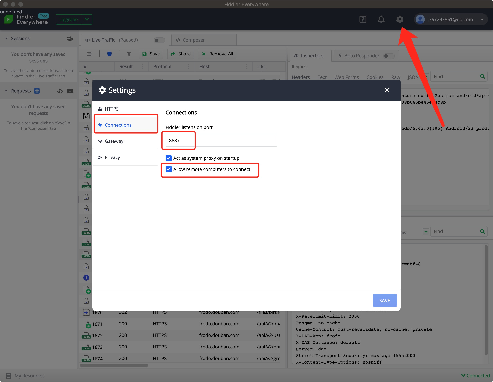
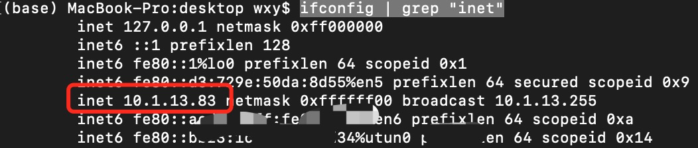
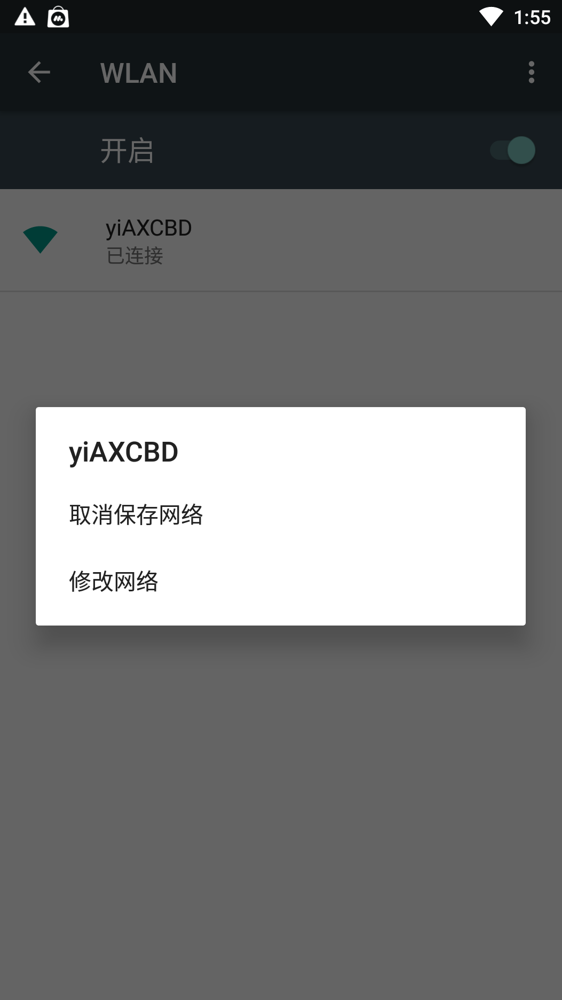
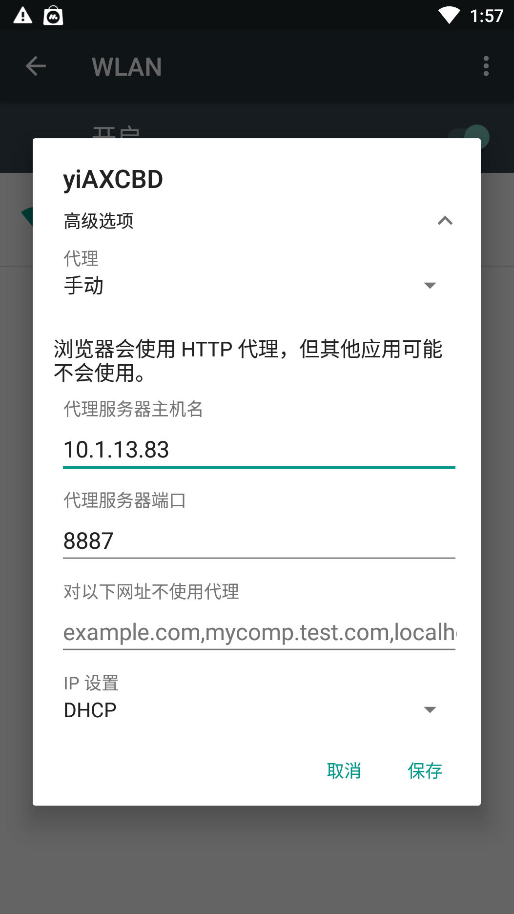
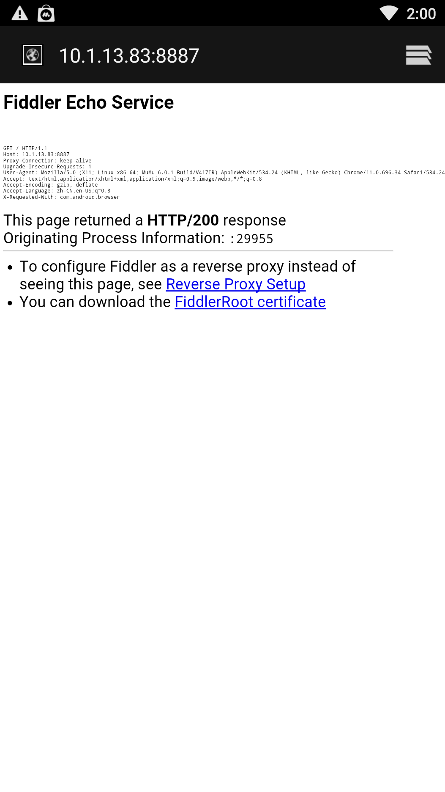
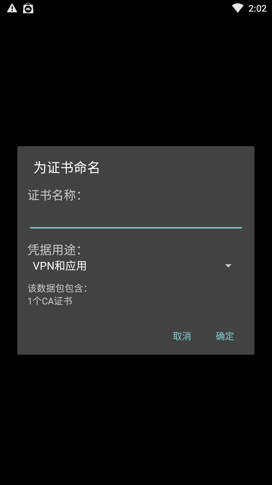
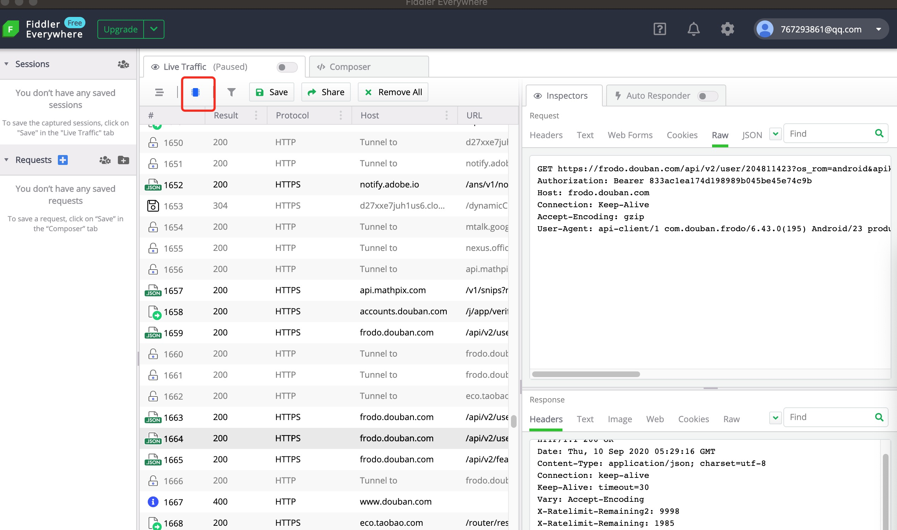

网上好多博客都是momo+fiddler的，而且抄来抄去，很少有真的能用的。

这里记一次fiddler for mac的使用体验。

### 第一步：安装和设置fiddler

[下载地址](https://www.telerik.com/download/fiddler-everywhere)

1. 点击右上角的设置图标
2. 选择connections选项卡
3. 勾选allow remote computer to connect
4. 调整fiddler listens on port（随便设置，不超过65535，不与其他程序占用的端口冲突即可）



查看电脑ip，终端输入`ifconfig | grep "inet"`



### 第二步：安装配置安卓模拟器

我这里选择的是[网易mumu安卓模拟器](https://www.baidu.com/link?url=K0AudkJQOs8O4uSjQHT3sypCuYB_4hliwPz2xj8XcXi&ck=5976.10.9999.389.396.263.137.1300&shh=www.baidu.com&sht=baiduhome_pg&wd=&eqid=ac99bd300000a8e2000000055f59b794)。

1. 打开模拟器，系统应用-设置-WLAN。鼠标**长按**yiAXCBD就会出现下图中的选项。

   

2. 选择修改网络，代理选择手动，填入主机ip和刚才设置的端口号

ps.也许安装其他安卓模拟器也可以，但是我是过夜神模拟器，下载证书的时候提示需要sd卡，可能是存储空间不够了吧，我找了半天也没找到调整的地方，就放弃了。

### 第三步：为安卓模拟器安装证书

1. 我们打开安卓模拟器的浏览器，在地址栏输入我们之前得到的fildder的ip地址（以下是我的）

```
10.1.13.83:8887
```

2. 点击下载下面的链接FiddlerRoot certificate



3. 点击下载完成的证书，证书名称随意，后面要设置pin或者手势之类的也都随意。

### 抓取豆瓣APP的网络请求

1. Fiddler左上角开启decode
2. 在模拟器中安装豆瓣app（这一步应该在之前就做好了）
3. 打开豆瓣app就可以抓包了。

### 参考资料

[fiddler for Mac](https://www.cnblogs.com/smallbo/p/12288846.html)

[豆瓣app 网络请求签名算法分析与解密](https://www.52pojie.cn/thread-1262453-1-1.html)

[豆瓣APP 登陆sign算法分析](https://bbs.125.la/thread-14226779-1-1.html)

### 感想

我只是想搞个豆瓣回帖机器人罢了，怎么这么麻烦啊🆘