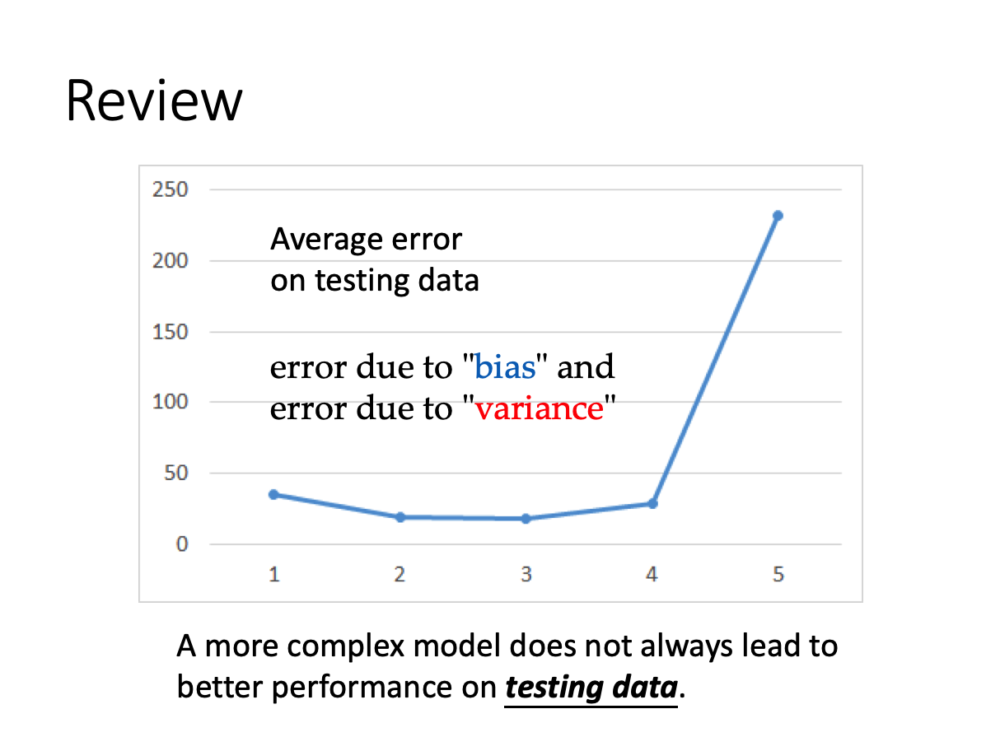
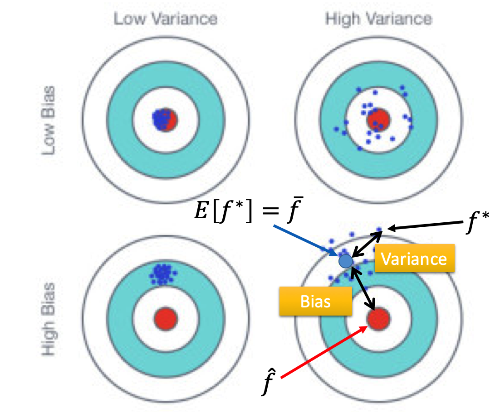

​		从之前的学习可以了解到，并不是复杂的模型就可以得到更好的训练结果。复杂的模型可能造成过拟合(overfitting)的情况。简单来讲，以线性回归为例，就是在过于贴合训练集上每一个数据点，导致曲线过于“崎岖”，而在测试集上的表现并没有更好，loss 变的更大了。

训练结果的错误来自于两方面：**偏差bias**和**方差variance**

假设变量x的期望为 μ 

m为不同训练结果得到的x均值

很显然$m=\frac{1}{N}\sum_{n}x^n\neqμ$

……

同理变量实际x和均值m做差得到的方差$s^2$不等于方差的期望$σ^2$

如下图可以看出bias和variance错误之间的差别以及对训练结果的影响。

其中$f^*$为不同训练集下，训练得到的合适的function

$\overline{f}$为$f^*$的期望，即得到的所有合适的function的平均

右上角的靶子可以看出，方差比较大的$f^*$比较分散，但是他们的均值m距离正确结果很近。

而左下角的靶子显示，bias比较大的$f^*$比较集中，但是他们的均值距离正确结果很远。

右下角的靶子表明，靶心和$\overline{f}$之间的偏差是由于bias导致的，而每一个单独的$f^*$与$\overline{f}$的偏差是由于variance

