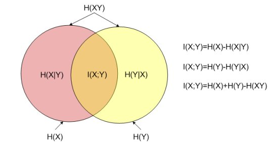

参考资料：

[A Short Introduction to Entropy, Cross-Entropy and KL-Divergence](https://www.youtube.com/watch?v=ErfnhcEV1O8)

[Joint, Conditional, & Mutual Information & A Case Study](https://www.youtube.com/watch?v=jkgKWmCb5AE)

[联合熵（joined entropy）、条件熵（conditional entropy）、相对熵（relative entropy）、互信息（mutual information）以及相关关系整理](https://blog.csdn.net/FrankieHello/article/details/89219940)

[什么是「互信息」？](https://www.zhihu.com/question/304499706/answer/1266281483)

## 熵

- excample1:

  若今天天气有两种可能（可能性均等）：晴天或者是雨天。

  用最少的bit来传递信息，则只需要1bits，即1表示晴天，0表示雨天；或者相反。

- excample2:

  假设今天天气有8种可能（可能性均等），

  则，实际传达的信息位数为$2^3 = 8$，$log_2(8)=3$，即3bits。

- excample3:

  如果可能性不同呢？

  假设晴天75%，雨天25%

  - 雨天传达的信息位数为$log_2(4) =  -log_2(0.25) =2$，即2bits

    从1到0.25，雨天的确定性下降到了1/4，我们得到的信息较多

  - 晴天传达的信息位数为$-log_2(0.75) =0.41$，即0.41bits

    从1到0.71，晴天的确定性下降的不多，但我们所得到的信息却很少

  我们平均从气象站中得到的信息：$0.75*0.41+0.25*2=0.81bits$

### 定义

熵是衡量随机变量不确定性的指标。

### 公式

  $\mathrm{H}(\mathbf{p})=-\Sigma_{i} p_{i} \log _{2}\left(p_{i}\right)$

  如果天气变化很大，熵将很大；反之，熵会很小。

## 交叉熵

  - 接下来我们将8种天气编码，如下图:

  

  ​	消息长度为3位，这就是**交叉熵**

  ​	cross-entropy=3

  - 8种天气的概率不同：

    熵=$0.35*log_2(0.35)+...+0.25*log_2(0.01)=2.23bits$

    这意味着每次发出3位信息，只有2.23位为有效信息。

  - 重新编写成不同长度的编码

    

    平均位数为2.42位，这是新的交叉熵，比之前的3位更好，但仍然不低于2.23位

  - 将编码反过来

    

    平均位数位4.58位， 是每条发送的必要消息的两倍。

  - 设p = 真实分布；q = 预测分布，则：

    

    Cross-Entropy:

    $\mathrm{H}(\mathrm{p}, \mathrm{q})=-\Sigma_{\mathrm{i}} p_{\mathrm{i}} \log _{2}\left(q_{i}\right)$

## KL-散度

交叉熵超过熵的量，我们称为KL-散度。

Cross-Entropy = Entropy + KL-Divergence。

KL Divergence:
$\mathrm{D}_{\mathrm{KL}}(p \| q)=\mathrm{H}(p, q)-\mathrm{H}(p)$

- 上面的例子中KL-散度为

  $\mathrm{D}_{\mathrm{KL}}(p \| q)=4.58-2.23$ = 2.35

## 联合熵（Joint Entropy）

联合熵是与一组随机变量相关的度量。

随机变量可以是二进制序列，序列的事件就是它的位。

两个变量的熵：
$$
H(X, Y)=-\sum_{x} \sum_{y} P(x, y) \log _{2}[P(x, y)]
$$
n个变量的熵：
$$
H\left(X_{1}, \ldots, X_{n}\right)=-\sum_{x_{1}} \ldots \sum_{x_{n}} P\left(x_{1}, \ldots, x_{n}\right) \log _{2}\left[P\left(x_{1}, \ldots, x_{n}\right)\right]
$$

- encample：假设2种天气和2种温度
  $$
  \begin{aligned}
  P(\operatorname{sunn} y, h o t) &=\frac{1}{2} \\
  P(\operatorname{sunn} y, \operatorname{cod}) &=\frac{1}{4} \\
  P(\operatorname{rain} y, \operatorname{cool}) &=\frac{1}{4} \\
  P(\operatorname{rain} y, \operatorname{hot}) &=0
  \end{aligned}
  $$
  根据联合熵公式，计算可得：
  $$
  \begin{aligned}
  H(X, Y) &=-\left[\frac{1}{2} \log \frac{1}{2}+\frac{1}{4} \log \frac{1}{4}+\frac{1}{4} \log \frac{1}{4}+0 \log 0\right] \\
  &=-\left[-\frac{1}{2}+-\frac{1}{2}+-\frac{1}{2}+0\right] \\
  &=\frac{3}{2}
  \end{aligned}
  $$
   这说明事件不是独立的，因为联合熵不等于事件联合概率的总和

## 条件熵（Conditional Entropy）

条件熵的表现形式是：
$$
H(X \mid Y)=-\sum_{x \in X, y \in Y} p(x \mid y) \log _{2}(p(x \mid y))
$$
当 $X,Y$是对立的随机变量时，条件熵的表现形式是：
$$
H(X \mid Y)=-\sum_{x \in X, y \in Y} p(x) \log _{2}(p(x))=H(X)
$$
条件熵和联合熵之间的关系是：
$$
H(X, Y)=H(X)+H(Y \mid X)=H(Y)+H(X \mid Y)
$$

- 当且仅当Y完全由X决定时，$H(X \mid Y)=0$
- 当且仅当Y和X是完全独立的的随机变量时，$H(X \mid Y)=H(Y)$
  - X不提供任何y的信息
  - 给定x条件下的y的熵等于，y的熵，无需考虑x。

(条件概率是y事件确认成立，然后发生x事件的概率)

## 互信息（Mutual Information）

对于两个随机变量 $X,Y$，它们的互信息可以定义为 $X,Y$的联合分布和对立分布乘积的相对熵。
$$
I(X ; Y)=D(p(x, y) \| p(x) q(y))=-\sum_{x \in X, y \in Y} p(x, y) \log _{2} \frac{p(x, y)}{p(x) p(y)}
$$
经过变形和计算可以得到互信息：
$$
I(X ; Y)=H(X)+H(Y)-H(X, Y)
$$
**互信息的意义是衡量$X$到$Y$的不确定性的减少程度**，(衡量随机变量之间相互依赖程度的度量。)

另外互信息是对称的（symmetric），也就是$I(X;Y)=I(Y;X)$，所以互信息不能用于确定信息流的方向。

使用概率的加和规则和乘积规则,我们看到互信息和条件熵之间的关系为
$$
I[\boldsymbol{x}, \boldsymbol{y}]=H[\boldsymbol{x}]-H[\boldsymbol{x} \mid \boldsymbol{y}]=H[\boldsymbol{y}]-H[\boldsymbol{y} \mid \boldsymbol{x}]
$$

- excample：

  > 比如说有一天你的女神突然问你：“你猜猜我的爱豆是TFboys里的谁？”
  >
  > 唉这要是猜不到女神的心岂不是很完蛋，追求女神的路从此就凉了。
  >
  > 正当你非常不确定的时候，女神又说：“给你个提示吧，名字是四个字。”
  >
  > 此时你特别开心，因为对于答案的不确定性一下子就减少了（当然这个例子比较极端，不确定性直接降为0）
  >
  > 所以，互信息的意思就是通过了知道一个变量减少了对另一个变量的不确定性。
  >
  > 这个不确定性减少的量也就是互信息的大小。
  > 链接：https://www.zhihu.com/question/304499706/answer/1266281483

## 总结

对于随机变量  $X,Y$，它们的熵、联合熵、条件熵以及互信息之间的关系是：

其中，左边的圆形区域表示随机变量$X$的熵，右边的圆形区域表示随机变量$Y$的熵。

左边的$H(X∣Y)$区域表示在随机变量$Y$给定的条件下随机变量$X$的条件熵；左边的$H(Y∣X)$区域表示在随机变量$X$给定的条件下随机变量$Y$的条件熵。

两个圆中间相交的部分表示随机变量$X,Y$的**互信息**。两个圆构成的整体部分表示$X,Y$的**联合熵**。