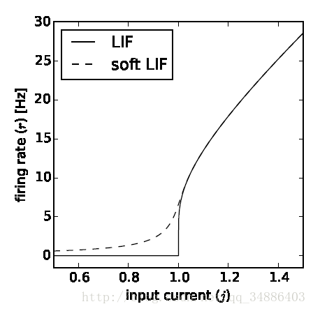
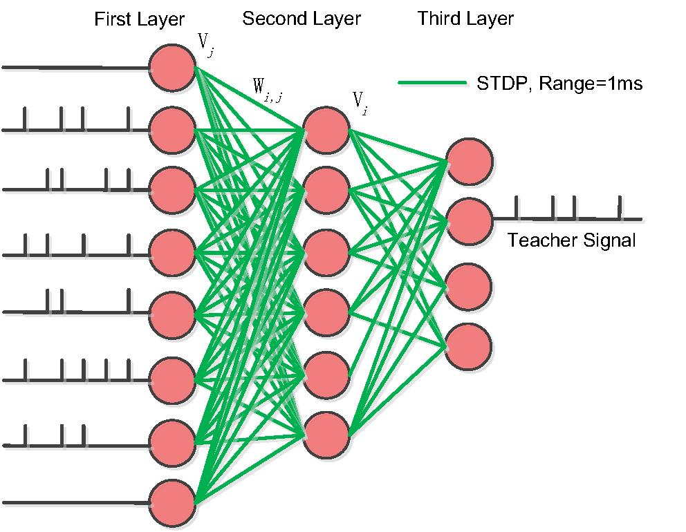
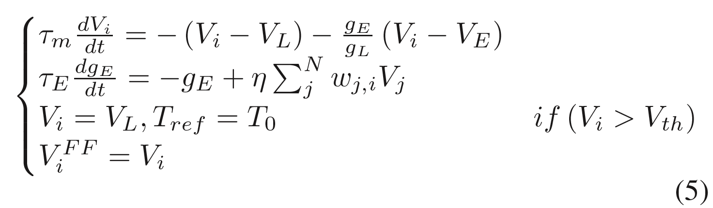
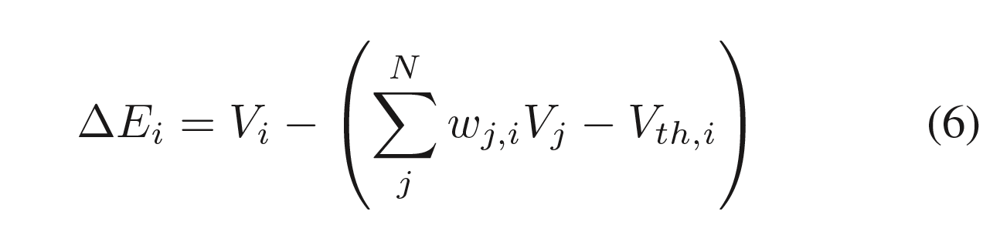
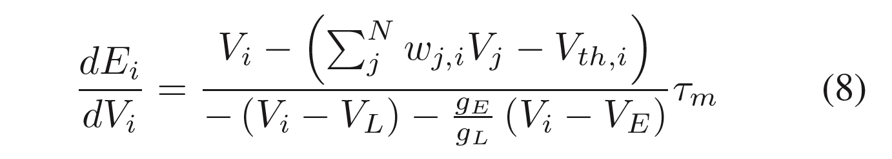
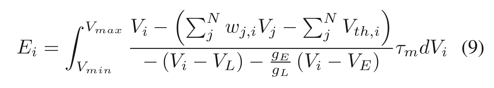
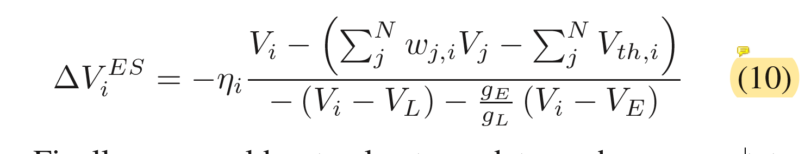
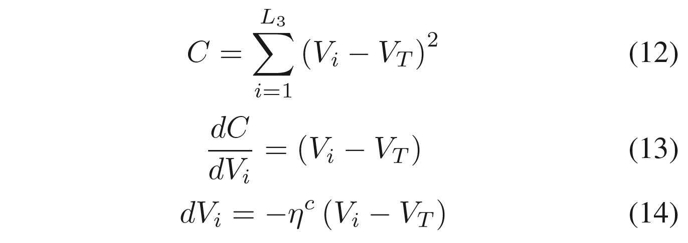
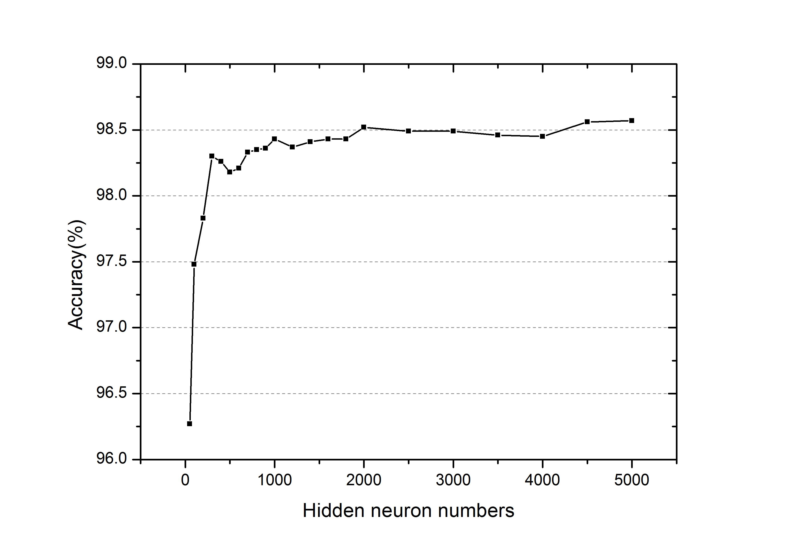
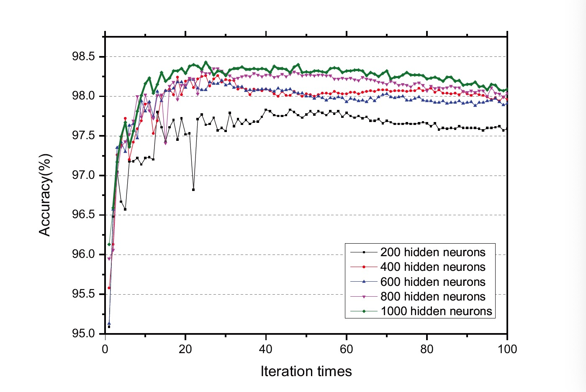

本文主要是AAAI-18上发表的论文《A Plasticity-Centric Approach to Train the Non-Differential Spiking Neural Networks》的阅读笔记。

# 脉冲神经网络概述

之前转载的文章：[脉冲神经网络（Spiking Neural Network，SNN）概述]([https://gulico.github.io/2019/11/04/%E8%84%89%E5%86%B2%E7%A5%9E%E7%BB%8F%E7%BD%91%E7%BB%9C%EF%BC%88Spiking-Neural-Network%EF%BC%8CSNN%EF%BC%89%E6%A6%82%E8%BF%B0/](https://gulico.github.io/2019/11/04/脉冲神经网络（Spiking-Neural-Network，SNN）概述/))

# 前置知识

- LF模型
  硬件模型：IF模型只有一个电容，没有并联的电阻，因为电阻实际等效于泄露电流，对应LIF模型。
  dVdt=1CI(t)dVdt=1CI(t)
- LIF模型
  当然我们侧重的并不是IF模型，而是 leaky integrate-and-fire模型（LIF），后者比前者更加接近真实的生物神经元，leaky表示泄露，由于细胞膜是不断进行膜内外离子的交换，所以当只有一次输入时，电压会自动发生泄漏逐渐回落到静息状态。对于LIF模型一般是认为先下降低于$V_{rest}$,再上升的静息电位处，而IF神经元一般是认为直接回落到静息状态处，这里涉及到一个reset电位。




# 目前存在的问题

- **误差反传不可用于脉冲神经网络优化**：传统的基于误差反传的学习方法已经被证明可以很好地优化人工神经网络，然而其**要求网络和神经元节点处处可微分**，因此便不再适用于脉冲神经网络的优化，其**原理也与生物脑的学习法则存在差距**。
  - p.s：不过我在GitHub 上看到一个基于PyTorch实现SLAYER的便于训练脉冲神经网络的项目（[PyTorch implementation of SLAYER for training Spiking Neural Networks](https://github.com/bamsumit/slayerPytorch)）
  - 论文🔗[SLAYER: Spike Layer Error Reassignment in Time](https://arxiv.org/abs/1810.08646v1)  该论文介绍了一种用于学习突触权重和轴突延迟的新的通用反向传播机制，该机制克服了脉冲函数的不可微问题，并使用时间信用分配策略将误差反向传播至前一层。
  - 莫名其妙搜到b站SLAYER的视频介绍[SLAYER: Spike LAYer Error Reassignment](https://www.bilibili.com/video/av74685090)
- 目前还没有一套针对脉冲神经网络的通用训练方法。但是考虑到生物系统中自有一套**可塑性学习机制指导着生物脉冲网络的学习和训练**，因此以生物可塑性原理出发，最终启发得到脉冲神经网络的训练方法，将会是一个可能的途径。

# 思路

- 首先，任何的理论优化方法，其最终目的都是为网络实现稳定的功能表达，在微观尺度即是神经元的膜电位改变和输入电流达到平衡，在宏观尺度即是**网络功能输出和信息输入达到平衡**。

- 其次，生物网络的训练中，**突触权值**往往是随着**突触前后神经元放电的状态变化**而**被动的更新**，如脉冲时序依赖的突触可塑性（Spike-Timing Dependent Plasticity， STDP）。

# 网络结构和训练步骤

## 网络结构

1. 第一层：脉冲输入层
2. 第二层：处理非线性&不连续特征的能力的隐层
3. 第三层：具有在教学信号指导下进行信号选择能力的输出层



## 训练步骤

由于脉冲序列不连续和非线性的特点，使用反向传播是不可行的，作者从**膜电位**的角度看突触的学习。

- 训练过程分四步，

  前两步无监督学习电位，

  第三步通过教学信号更新后两层的神经元膜电位，

  第四步利用STDP或者hebb规则被动更新神经元之间的突触。

### snn中的前馈理论

输入将具有向下一层的前馈传输，并动态改变神经元的状态。

然后信息将继续传递，直到到达输出层。

在训练过程中，前馈信息的传播将与平衡状态学习和监督学习相结合，成为神经元膜电位动态变化的三大动力。

训练结束后，只剩下规则一用于顺序推理测试。



### snn中的无监督分层平衡状态学习

- 理论基础：snn中存在的两种平衡状态：
  - 时间平衡态：随着时间的推移，膜电位将会达到平衡态
  - 空间平衡态：描述神经元输入输出的平衡

  意味着在训练过程中，网络会反复收敛，直到停在一个静态点，这意味着随着训练时间的延长，权值的总更新量会越来越小，最后网络会停在平衡膜电位状态。

  接下来的两个步骤中，无监督状态学习将会为分类任务做好准备。



式6中，左侧表示状态变化量，右侧第一项是神经元当前膜电位，第二项是神经元未来的膜电位，整合了突触前的所有膜电位与对应权值的乘积之和。随着训练的进行，神经元的当前状态和下一个状态将达到相等，即状态不再更新。

膜电位取代权值进行网络调节。



从式8可得，$E_i$为神经元的平衡状态，式子中可以看出膜电位的更新会降低整个网络的平衡性，也就是$E_i$增大。所以我们又将这个状态叫做snn的能量。





连续方程（9）可以通过欧拉方法近似地由离散方程（10）表示。$V_i^{ES}$是平衡态下膜电位对$V_i$的更新。而ηi是包含变量τm的学习率。


整合式子5和10中的无监督前馈学习，我们可以对所有的神经元电位进行更新。式子11为整个snn膜电位收敛方向特征。

（关于这里式子11整合的两个膜电位，张铁林教授的解释是：占比没有生物上的考虑，只是优化上的考虑。因为网络学好之后，还是要完全剔除平衡态变化才是。）

### 最后两层中的监督学习

在这里，我们在训练的最后一层SNN中加入了**教学信号**程序。

教学信号实际上是固定频率的刺激，其间隔与输入信号的间隔相同。

由于第三层的错误信号不能反向传播到第一层和第二层，因此可以认为它是一个非常弱的有监督学习规则。



如式（12）所示，SNN的误差是真实神经元膜电位$V_i$与教师信号$V_T$之差的平方的累加和。ηc为学习率，L3为最后一层神经元数。

与传统的人工神经网络不同，在反向传播过程中，每一层都会迭代计算梯度下降，如式（13）和式（14）所示，我们只使用一次对SNN的最后一层进行微分计算。这个规则也可以被Hebb规则所取代。

### 基于STDP的突触权值被动更新

stdp规则也有许多人提出过不同的细则，我们这里使用Bengio在2015年提出的规则：突触权值变化量等于突触前膜电位与突触后膜电位关于时间的变化率。 

（这边的公式是个正比关系，不是很明确，所以这里邮件给张铁林研究员，他说叫我去看了一下differentials stdp）

### snn学习算法伪码

```pseudocode
1. 空间和时间数据标准化，以及变量初始化.
初始化多层前馈网络，lif神经元模型, 使用随机均匀分布对权值$w_{ij}$进行初始化，神经元膜电位状态$V_i$
设置迭代时间$I_{ite}$，模拟时间T，微分时间Δt，学习率η（前两层） 和 ηc（最后一层）;
2. 开始训练程序:
(1). Load training samples;
//加载训练样本

(2). Update V FFi by Equation (5) during the feed forward inference learning;
//在前馈阶段，根据等式5更新突触后膜电位V FFi
(3). Update V ESi by Equation (10) during the unsupervised equilibrium state learning;
//在无监督平衡阶段，根据等式10更新突触后膜电位V ESi
(4). Integrate V FFi and V ESi by Equation (11);
//通过等式11，整合前面两步计算得到的膜电位V FFi和V ESi
(5). Update Vi by Equation (14) with supervision;
//根据等式14，通过教学信号更新vi
(6). Passively update synaptic weights wj,i by Equation (15).
//被动更新突触权值

(7). Iterative training from Step (2) to Step (6), save final wj,i.
//循环步骤2-6，保存最后的权值

3. 开始测试程序:
(1). Test the performance of trained SNN with only feed forward
step based on saved wj,i.
//通过基于最后得到的权值，进行前向传播，测试snn的性能
(2). Output the performance of test samples without cross validation;
//不实用交叉验证的情况下输出测试样例的性能
4. End SNN learning.
```

# 实验



为了验证上述四个步骤网络训练的有效性，我们采用最简的三层脉冲神经网络进行测试。

如图，最终在MNIST任务上达到分类正确率为98.52%。

已是应用生物神经可塑性进行训练的**纯脉冲神经网络应用到MNIST数据集上取得的最好结果**，在我们的工作之前，最好的是2015年的一个结果，大致在95%左右。 

此外，作者还测试了三层SNN在不同数目的隐神经元上的性能，将迭代次数设为100，patch大小设为10，学习率设为0.05。



SNNs对MNIST分类任务的准确度如图6所示。我们从图6中观察到：

（1）精度一般会随着**迭代次数**的增加而提高，最终收敛并停止在一个稳定的值上；

（2）不同结构之间的精度不同，通常**隐层神经元较多**的网络会有更好的性能。

因此SNN的精度将取决于具体的**迭代时间和网络结构**。在这里，我们将选择迭代时间内的最佳精度值作为此类架构的性能。另外，对于不同的结构，如图7所示，三层SNN结构中隐藏4500个神经元，其最佳准确率为98.52%。

### 论文意义

- 关于无监督学习尤其是平衡态学习的作用目前还不清楚。但是经过测试经过snn突触权值学习后，网络会具有更好的分类和聚类特性。

- 意义

  曾毅研究员介绍到：“这篇文章（A Plasticity-centric Approach to Train the Non-differential Spiking Neural Networks）使得类脑脉冲神经网络在MNIST手写数字识别问题上基本上具备了与深度神经网络的可比性，然而这甚至不是最重要的。用脉冲神经元替换通过反向传播训练的人工神经网络上的神经元，可以构建**卷积脉冲神经网络(Convolutional SNN)，正确率甚至还可以进一步达到99.1%**,但是这样的学习机制实际上仍然是人工神经网络和反向传播在发挥作用，而**不是脉冲神经网络的能力**，更不是真正的脑启发的学习机制。我们的正确率虽然没有Convolutional SNN高，但是文章仍然被接收，我觉得原因正在于我们的模型具备相对更全面的生物合理性，因此更能**反映智能的本质**，揭示了生物脑可塑性的原理应用到人工智能问题上的潜力”。“此外，这其实只是我们围绕生物可塑性体系化研究工作的一个小点，未来的探索将更激动人心！”曾毅研究员对此充满信心。

# 参考

[中国科学院自动化研究所：以生物可塑性为核心的类脑脉冲神经网络](http://www.ia.cas.cn/xwzx/kydt/201801/t20180119_4936457.html)

[A Plasticity-centric Approach to Train the Non-differential Spiking Neural Networks](http://www.aaai.org/Library/AAAI/aaai18contents.php)