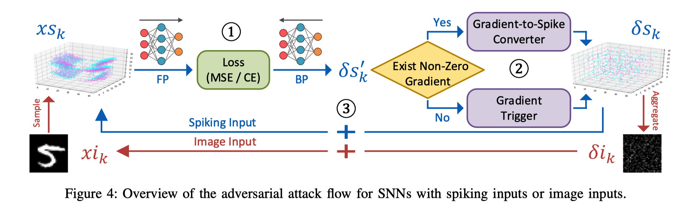
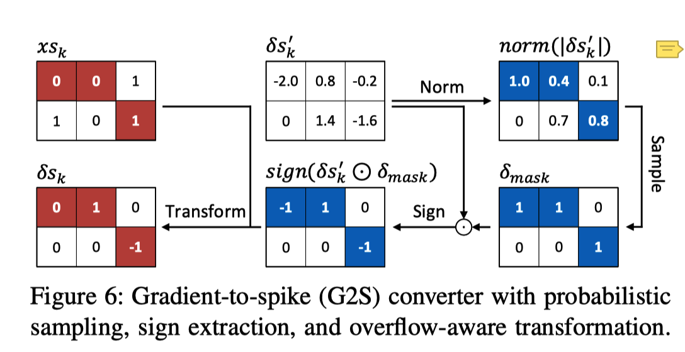
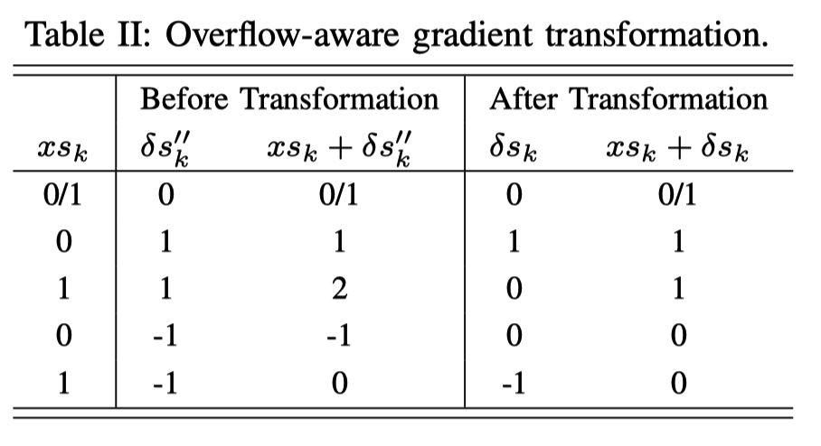
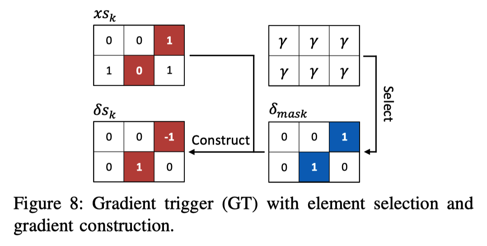
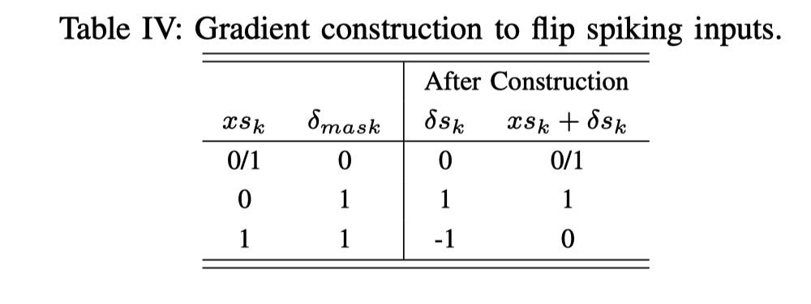

Liang, L., Hu, X., Deng, L., Wu, Y., Li, G., Ding, Y., Li, P., & Xie, Y. (2020). *Exploring Adversarial Attack in Spiking Neural Networks with Spike-Compatible Gradient*. 1–14. http://arxiv.org/abs/2001.01587

# SNN攻击对抗的挑战：

i）SNN中的梯度信息呈现为时空模式，而传统的学习算法，如无梯度的无监督学习和仅空间梯度的ANN到SNN转换学习很难获得。 

ii）**梯度是连续值，与二进制输入不兼容**。这种数据格式不兼容会阻止通过梯度累积生成基于脉冲的对抗样本。

iii）当梯度以零占多数的导数与阶跃(fire)函数交叉时，**梯度将消失**，这将中断对抗性示例的更新。

解决问题：**梯度输入不相容和梯度消失。**

# 贡献：

- 首次通过脉冲兼容梯度实现了精确的SNN攻击。

- 建立了一种基于监督算法的snn对抗攻击方法（白盒攻击）

  1. 设计了一个梯度脉冲（G2S）转换器，将连续梯度转换为与脉冲输入兼容的三值梯度。

     该设计利用了概率采样，符号提取和溢出感知转换，这些转换可以在保持脉冲格式的同时控制扰动幅度。-》解决梯度输入不兼容问题

  2. 设计了一个梯度触发器（GT）来构造三值梯度，该触发器可以在全零梯度的情况下随机翻转二进制输入。使用基线采样因子（baseline sampling factor）来限制总周转率（turnover rate），从而使扰动幅度可控。-》解决梯度消失问题

  3. （1&2）将这些方法结合起来，建立了一种针对基于监督算法训练的SNN的基于梯度的对抗攻击方法。 在我们的设计中，扰动幅度得到了很好的控制。

  直接生成的脉冲对抗样本使我们的方法适用于无图像的脉冲数据源。 

  对于使用基于图像的数据源的SNN模型，我们的解决方案也适用于时空梯度的简单时间聚合。

- 在针对非针对性和针对性攻击的这种攻击方法下，我们分析了两个重要因素对攻击有效性的影响

1. 训练损失函数的格式和射击阈值。我们为通过交叉熵（CE）损失训练的模型找到了一个“陷阱”区域，与通过均方差（MSE）损失训练的模型相比，它更难攻击。幸运的是，可以通过调整倒数第二层的发射阈值来逃脱“陷阱”区域。通过大量的实验验证了该方案的有效性，在大多数基准上攻击成功率达到99%以上，是SNN攻击的最佳结果。
2. 除了对影响因素的定量分析外，我们还证明snn比ann更能抵抗对抗性攻击。

通常，有两种实现对抗攻击的方法：基于内容的方法和基于梯度的方法。 

前者直接修改输入的语义信息（例如，亮度，旋转度等），或将预先定义的Trojan注入输入中； 

后者根据指定标签下的输入梯度修改输入。 

基于梯度的对抗攻击能够达到更好的攻击效果，这是本文的重点。

白盒攻击是了解对抗攻击的基本步骤，它更适合于研究针对SNN的直接对抗攻击的第一项工作。 此外，为白盒攻击构建的方法可以在将来轻松地转移到黑盒攻击。

# SNN模型

- LIF神经元模型

$$
\left\{\begin{array}{l}
{\tau \frac{d u(t)}{d t}=-u(t)+\sum_{j} w_{j} o_{j}(t)} \\
\left\{\begin{array}{l}
{ {o(t)=1 \& u(t)=u_{0}, \text { if } u(t) \geq u_{t h} } \\
{o(t)=0, \text { if } u(t)<u_{t h} } }
\end{array}\right.
\end{array}\right.
$$

其中t表示时间步长

τ是时间常数

u和o分别表示膜电位和产生的输出脉冲。 

w j是第j个神经元与当前神经元之间的突触权重

o j是第j个神经元的输出脉冲（也作为当前神经元的输入脉冲）。

u th是提到的触发阈值

u 0是触发脉冲后使用的复位电位。

- 网络结构：
  - 前馈SNN的网络结构可以与ANN相似，包括卷积（Conv）层，池化层和完全连接（FC）层。 
  - 网络输入可以是由动态视觉传感器捕获的脉冲事件（即神经形态数据集），也可以是通过伯努利采样从正常图像数据集转换而来的。 
  - 分类是基于输出层的脉冲进行的。

# 基于梯度的攻击对抗

定义$x^{\prime}=x+\delta$为对抗样本。 

干扰受$\|\delta\|_{p}=\left\|x^{\prime}-x\right\|_{p} \leq \epsilon$约束，其中∥·∥p表示p范数，反映了最大可容许干扰。

对抗性攻击公式化为如下所示的优化问题，以搜索最小的干扰：
$$
\left\{\begin{array}{l}
{\arg \min \|\delta\|_{p}, \quad \text { s.t. } f(x+\delta) \neq f(x), \quad \text { if untargeted } } \\
{\text { arg min }\|\delta\|_{p}, \quad \text { s.t. } f(x+\delta)=y \text { target }, \quad \text { if targeted } }
\end{array}\right.
$$

## 快速梯度符号法（FGSM）

思想：计算输入图像的梯度图，然后通过乘以较小的比例因子在原始图像中添加或减去该输入梯度图的符号。 对抗性例子的产生可以表示为：
$$
\left\{\begin{array}{l}
{x^{\prime}=x+\eta \cdot \operatorname{sign}\left(\nabla_{x} L\left(\theta, x, y_{\text {orginal} }\right)\right), \text {if untargeted } } \\
{x^{\prime}=x-\eta \cdot \operatorname{sign}\left(\nabla_{x} L\left(\theta, x, y_{\text {target} }\right)\right), \text {if targeted } }
\end{array}\right.
$$
其中L和θ表示损失模型的损失函数和参数。 

η用于控制干扰的大小，通常很小。 

在无目标攻击中，对抗示例将使输出脱离原始正确的类，这是基于梯度上升的输入修改造成的； 

而在有针对性的攻击中，由于基于梯度下降的输入修改，对抗示例下的输出将流向目标类。

## 基本迭代法（BIM）

BIM算法实际上是上述FGSM的迭代版本，它以迭代的方式更新对抗示例，直到攻击成功。
$$
\left\{\begin{array}{l}
{x_{k+1}^{\prime}=x_{k}^{\prime}+\eta \cdot \operatorname{sign}\left(\nabla_{x_{k}^{\prime} } L\left(\theta, x_{k}^{\prime}, y_{\text {orginal} }\right)\right), \text {if untargeted } } \\
{x_{k+1}^{\prime}=x_{k}^{\prime}-\eta \cdot \operatorname{sign}\left(\nabla_{x_{k}^{\prime} } L\left(\theta, x_{k}^{\prime}, y_{\text {target } }\right)\right), \text { if targeted } }
\end{array}\right.
$$
i为迭代次数；

当k=0时，$x_{k}^{\prime}$为原始输入。

# 解决方法

对抗性攻击的工作流程。 分为三个阶段：前向传递以获取模型预测，后向传递以计算输入梯度，以及输入更新以生成对抗性示例。 

## 获取时空梯度

### 问题：snn难以获取时空梯度

在前馈ANN中，激活和梯度都只涉及空间维，而没有时间分量。对于每个特征图，其向后传播期间的坡度仍为2D形状。而由于附加的时间维度，每个梯度图在SNN中变为3D。用传统的SNN学习算法很难获取时空梯度。

例如，无监督学习规则（例如STDP）会根据局部神经元的活动更新突触，而无需计算有监督的梯度；ANN到SNN转换学习方法只是将SNN学习问题转换为ANN学习问题，导致无法捕获时间梯度。

### 解决：反向传播（BPTT）启发式学习算法

提高SNN的准确性。这种新兴的监督学习有望通过直接获取时空维度上的梯度来实现准确的SNN攻击。

（其他的解决方法都在贡献中）

# 先前的工作

## 反复试验输入扰动

- 思想：通过监视输出的变化以反复试验的方式干扰输入。

- 例子：
  - **在脉冲采样之前修改原始图像输入**。 首先在图像中选择一个像素块，然后在每个像素上添加正或负单位干扰。监视输出变化以确定干扰，直到攻击成功或干扰超过阈值为止。 
  - **直接干扰脉冲输入而不是原始图像输入**。 主要思想是翻转输入脉冲并监视输出。
- 缺点：由于搜索空间大而没有监督梯度的指导，因此计算复杂度很高。

## SNN / ANN模型转换

- 思想：他们首先建立一个具有从训练过的SNN模型复制的相同网络结构和参数的ANN替代模型。然后在构建的ANN副本上进行基于梯度的对抗攻击，以生成对抗样本。

- 缺点：
  - 需要额外的模型转换，并且在SNN到ANN转换期间会汇总时间信息。
  - 使用独特的模型作为替代模型，并且缺少时间成分，最终会损害攻击效果。
  - 此外，如果没有额外的信号转换，该方法不适用于无图像的脉冲数据源。

# 对snn的攻击对抗

## 输入数据格式

- 数据集：
  - N-MNIST 和CIFAR10-DVS（包含脉冲事件的数据集）
    - 输入最初是时空模式的，每个元素都有一个二进制值（0-无； 1-脉冲）。 
    - 攻击者可以翻转所选元素的状态，同时必须保持二进制格式。
  - 使用Bernoulli采样将像素强度转换为脉冲序列，其中脉冲率与强度值成比例。
    - 攻击者可以通过添加连续扰动来修改所选像素的强度值。

## 攻击流程

如前所述，分为三个阶段：向前通过（FP），向后通过（BP）和输入更新，这些操作将反复执行直到攻击成功为止。

### 生成对抗样本的基本算法选择->BIM算法

脉冲的扰动只能偏移选定输入元素的二进制状态（0或1），而不能增加连续值。 因此，为了生成能够跨越决策边界的脉冲攻击样本，候选元素的搜索比扰动幅度更为重要。 

FGSM仅探索扰动幅度，而BIM通过在不同迭代中搜索新的候选元素来实现。

### 不同输入的流程

- 脉冲输入

  - 蓝色箭头表示脉冲输入的情况。

  - 攻击样本的生成取决于以下三个步骤。 

    1. 以下步骤在FP和BP阶段计算连续梯度：
       $$
       \left\{\begin{array}{l}
       {\delta s_{k}^{\prime}=\nabla_{x s_{k}^{\prime} } L\left(\theta, x s_{k}, y_{\text {original \right), \text {if untargeted } } \\
       {\delta s_{k}^{\prime}=-\nabla_{x s_{k}^{\prime} } L\left(\theta, x s_{k}, y_{\text {target} }\right), \text {if targeted } }
       \end{array}\right.
       $$
       其中δs'表示第k次迭代的输入梯度图。 

    2. 由于δs'中的所有元素都是连续值，因此它们k不能直接累加到脉冲输入（即xs k）上，以避免破坏二进制脉冲的数据格式。 

       因此，使用G2S转换器将连续梯度图转换为与脉冲输入兼容的三元映射，从而可以同时保持输入数据格式并控制扰动幅度。 

    3. 当输入梯度消失（即δs'中的所有元素均为零）时，使用GT构造一个三元梯度图，该图可以以可控的周转率随机翻转输入脉冲。 

    4. 最后，步骤3将三元梯度累加到脉冲输入上。

- 图像输入

  - 通过伯努利采样将图像数据集转换为脉冲输入。 

  - 在这种情况下，还需要执行一个步骤来生成图像样式的攻击样本，如图4的红色箭头所示。

    在上述步骤○2之后，应在时间维度上聚合三元梯度图，即对所有元素求平均，属于同一空间位置但在不同的时间步中。 
    $$
    \delta i_{k}=\frac{1}{T} \sum_{t=1}^{T} \delta s_{k}^{t}
    $$
    在该时间聚集之后，可以获取图像兼容的输入干扰。 

### 时空梯度的获取（看不懂！！？）

受时间反向传播（BPTT）的启发，用于获取时空梯度。

- 将原始LIF神经元模型转换为等效的迭代版本

  - $$
    \left\{\begin{array}{l}
    {u_{i}^{t+1, n+1}=e^{-\frac{d t}{\tau} } u_{i}^{t, n+1}\left(1-o_{i}^{t, n+1}\right)+\sum_{j} w_{i j}^{n} o_{j}^{t+1, n} } \\
    {o_{i}^{t+1, n+1}=\text { fire }\left(u_{i}^{t+1, n+1}-u_{t h}\right)}
    \end{array}\right.
    $$

  - 其中t和n分别代表模拟时间步长和层的指数，dt是时间步长，eτ-dt反映了膜电位的泄漏效应。 

    fire（·）是一个阶跃函数，当x≥0时满足fire（x）= 1，否则，fire（x）=0。

    此迭代LIF模型合并了脉冲神经元的所有行为，包括整合，激活和重置。

- 损失函数——脉冲率编码被广泛用于将输出层的时空脉冲模式转换为脉冲率向量

  - $$
    y_{i}=\frac{1}{T} \sum_{t=1}^{T} o_{i}^{t, N}
    $$

  - N是输出层索引，T是模拟时间窗口的长度。 

  - 该脉冲速率向量可以视为ANN中的正常输出向量。 

  - 通过此输出转换，也可以将ANN的典型损耗函数（例如均方误差（MSE）和交叉熵（CE））用作SNN的损耗函数。

- 基于迭代LIF神经元模型和给定的损失函数，可以通过以下方式控制梯度传播：

  - $$
    \left\{\begin{array}{l}
    {\frac{\partial L}{\partial o_{i}^{t, n} }=\sum_{j} \frac{\partial L}{\partial o_{j}^{t, n+1} } \frac{\partial o_{j}^{t, n+1} }{\partial o_{i}^{t, n} }+\frac{\partial L}{\partial o_{i}^{t+1, n} } \frac{\partial o_{i}^{t+1, n} }{\partial o_{i}^{t, n} } } \\
    {\frac{\partial L}{\partial u_{i}^{t, n} }=\frac{\partial L}{\partial o_{i}^{t, n} } \frac{\partial o_{i}^{t, n} }{\partial u_{i}^{t, n} }+\frac{\partial L}{\partial o_{i}^{t+1, n} } \frac{\partial o_{i}^{t+1, n} }{\partial u_{i}^{t, n} } }
    \end{array}\right.
    $$

- 发射函数是不可微的，即∂u∂o不存在。 如前所述，引入了类似于狄拉克的函数来近似其导数。（具体看原文）
  
  - 产生了大量的零梯度，这可能**导致梯度消失的问题**。

### G2S转换器（Gradient-to-Spike (G2S) Converter）

- 目标：

  （1）最终梯度应与脉冲输入兼容，即在梯度累积后保持脉冲格式不变； 

  （2）干扰幅度应该是不可见的，即限制非零梯度的数量。 

  G2S转换器的功能概括如下：
  $$
  \delta s_{k}=\operatorname{transform}\left[\operatorname{sign}\left(\delta s_{k}^{\prime} \odot \delta_{m a s k}\right), x s_{k}\right]
  $$

- 步骤：

  - 概率采样

    - 通过公式（5）获得的输入梯度图的绝对值，即| δs'| 首先将k归一化为[0，1]。 

    - 然后，对归一化的梯度图即norm（|δs'|）进行采样，以生成具有相同形状的二进制k掩码，其中1表示梯度可以通过的位置。 每个梯度元素的概率抽样服从

    - $$
      \left\{\begin{array}{l}
      {P\left(\delta_{\text {mask} }=1\right)=\operatorname{norm}\left(\left|\delta s_{k}^{\prime}\right|\right)} \\
      {P\left(\delta_{\text {mask} }=0\right)=1-\text {norm}\left(\left|\delta s_{k}^{\prime}\right|\right)}
      \end{array}\right.
      $$

    - 较大的梯度具有较大的可能性使该梯度通过。 

    - 通过将结果掩码与原始梯度图相乘，可以显着减少非零元素的数量。 

  - 符号提取——生成一个三元梯度图

    - 三元梯度图：每个元素都位于{−1，0，1}中，在累加到二进制值为{0，1}的脉冲输入后，可以保持脉冲格式。 

    - 生成一个三元梯度图仅基于符号提取：

    - $$
      \delta s_{k}^{\prime \prime}=\operatorname{sign}\left(\delta s_{k}^{\prime} \odot \delta_{m a s k}\right)
      $$

    - 其中，$x>0时，sign(x)=1$；$x=0时，sign(x)=0$；$x<0时，sign(x)=-1$

  - 溢出感知转换

    - 虽然上述$\delta s_{k}^{\prime \prime}$可以是三元的，但它不能保证由输入梯度累积产生的攻击样本仍然局限于{0，1}。
    - 流感知梯度变换来限制最终对抗例子的范围，如表所示
    - 
    - #### 其中transform（·）表示过度敏感转换。

### 梯度触发器（GT，Gradient Trigger）

- 目的：通过人工构造梯度来解决梯度消失问题。

  梯度触发器的功能概括如下：
  $$
  \delta s_{k}=\text { construct }\left(\delta_{\text {mask} }, x s_{k}\right)
  $$

- 步骤：

  - 元素选择

    - 梯度初始化，将所有元素设置为γ，如图8所示。γ是在[0，1]范围内的一个因子，它控制GT后非零梯度的数量。
    - 公式（10）中的概率抽样仍然适用于生成掩码$\delta_{mask}$。

  - 梯度构造

    - 为了保持攻击样本的脉冲格式，我们只需翻转选定区域中脉冲输入的状态。

      这里翻转意味着如果当前元素状态为“1”，则将元素状态切换为“0”，反之亦然。

    - 表四说明了能够反映峰值输入的三元梯度的构造。

    - 

### 均方误差损失（MSE）和交叉熵损失（CE）