## 1. The Problem of Overfitting

### 1

还是来看预测房价的这个例子，我们先对该数据做线性回归，也就是左边第一张图。

如果这么做，我们可以获得拟合数据的这样一条直线，但是，实际上这并不是一个很好的模型。我们看看这些数据，很明显，随着房子面积增大，住房价格的变化趋于稳定或者说越往右越平缓。因此线性回归并没有很好拟合训练数据。

> **我们把此类情况称为欠拟合(underfitting)，或者叫作叫做高偏差(bias)。**

这两种说法大致相似，都表示没有很好地拟合训练数据。高偏差这个词是 machine learning 的研究初期传下来的一个专业名词，具体到这个问题，意思就是说如果用线性回归这个算法去拟合训练数据，那么该算法实际上会产生一个非常大的偏差或者说存在一个很强的偏见。

第二幅图，我们在中间加入一个二次项，也就是说对于这幅数据我们用二次函数去拟合。自然，可以拟合出一条曲线，事实也证明这个拟合效果很好。

另一个极端情况是，如果在第三幅图中对于该数据集用一个四次多项式来拟合。因此在这里我们有五个参数θ0到θ4，这样我们同样可以拟合一条曲线，通过我们的五个训练样本，我们可以得到如右图的一条曲线。

一方面，我们似乎对训练数据做了一个很好的拟合，因为这条曲线通过了所有的训练实例。但是，这实际上是一条很扭曲的曲线，它不停上下波动。因此，事实上我们并不认为它是一个预测房价的好模型。

> **所以，我们把这类情况叫做过拟合(overfitting)，也叫高方差(variance)。**

与高偏差一样，高方差同样也是一个历史上的叫法。从第一印象上来说，如果我们拟合一个高阶多项式，那么这个函数能很好的拟合训练集（能拟合几乎所有的训练数据），但这也就面临函数可能太过庞大的问题，变量太多。

**同时如果我们没有足够的数据集（训练集）去约束这个变量过多的模型，那么就会发生过拟合。**

### 2

过度拟合的问题通常发生在变量（特征）过多的时候。这种情况下训练出的方程总是能很好的拟合训练数据，也就是说，我们的代价函数可能非常接近于 0 或者就为 0。

但是，这样的曲线千方百计的去拟合训练数据，这样会导致它无法泛化到新的数据样本中，以至于无法预测新样本价格。在这里，**术语"泛化"指的是一个假设模型能够应用到新样本的能力。**新样本数据是指没有出现在训练集中的数据。

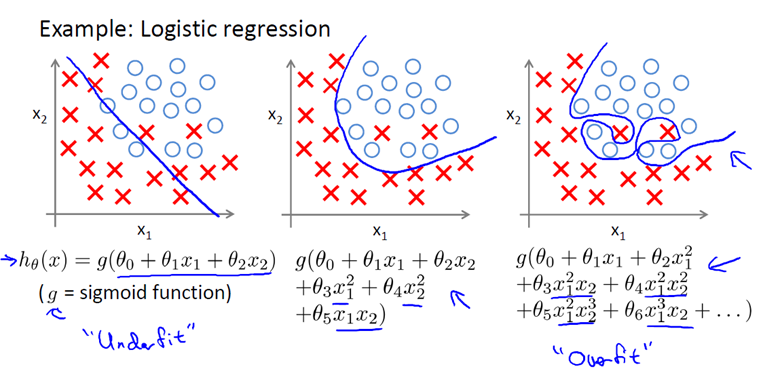

之前，我们看到了线性回归情况下的过拟合。类似的情况也适用于逻辑回归。

### 3

那么，如果发生了过拟合问题，我们应该如何处理？

过多的变量（特征），同时只有非常少的训练数据，会导致出现过度拟合的问题。因此为了解决过度拟合，有以下两个办法。

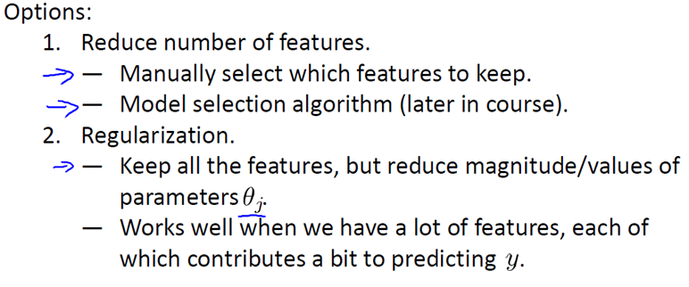

> **方法一：尽量减少选取变量的数量**

具体而言，我们可以人工检查每一项变量，并以此来确定哪些变量更为重要，然后，保留那些更为重要的特征变量。至于，哪些变量应该舍弃，我们以后在讨论，这会涉及到模型选择算法，这种算法是可以自动选择采用哪些特征变量，自动舍弃不需要的变量。这类做法非常有效，但是其缺点是当你舍弃一部分特征变量时，你也舍弃了问题中的一些信息。例如，也许所有的特征变量对于预测房价都是有用的，我们实际上并不想舍弃一些信息或者说舍弃这些特征变量。

> **方法二：正则化**

正则化中我们将保留所有的特征变量，但是会减小特征变量的数量级（参数数值的大小θ(j)）。

这个方法非常有效，当我们有很多特征变量时，其中每一个变量都能对预测产生一点影响。正如我们在房价预测的例子中看到的那样，我们可以有很多特征变量，其中每一个变量都是有用的，因此我们不希望把它们删掉，这就导致了正则化概念的发生。

接下来我们会讨论怎样应用正则化和什么叫做正则化均值，然后将开始讨论怎样使用正则化来使学习算法正常工作，并避免过拟合。

## 2. Cost Function

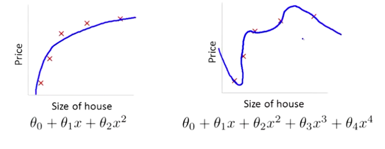

### 1

在前面的介绍中，我们看到了如果用一个二次函数来拟合这些数据，那么它给了我们一个对数据很好的拟合。然而，如果我们用一个更高次的多项式去拟合，最终我们可能会得到一个曲线，它能很好地拟合训练集，但却并不是一个好的结果，因为它过度拟合了数据，因此，一般性并不是很好。

让我们考虑下面的假设，我们想要加上**惩罚项**，从而使参数 θ3 和 θ4 足够的小。

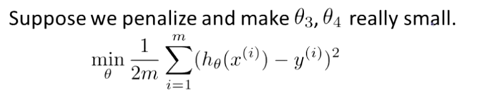

这里我的意思就是，上图的式子是我们的优化目标，也就是说我们需要尽量减少代价函数的均方误差。

对于这个函数我们对它添加一些项，加上 1000 乘以 θ3 的平方，再加上 1000 乘以 θ4 的平方，

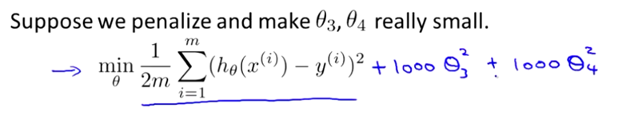

1000 只是我随便写的某个较大的数字而已。现在，如果我们要最小化这个函数，那么为了最小化这个新的代价函数，我们要让 θ3 和 θ4 尽可能小。因为，如果你在原有代价函数的基础上加上 1000 乘以 θ3 这一项 ，那么这个新的代价函数将变得很大，所以，当我们最小化这个新的代价函数时， 我们将使 θ3 的值接近于 0，同样 θ4 的值也接近于 0，就像我们忽略了这两个值一样。如果我们做到这一点（ θ3 和 θ4 接近 0 ），那么我们将得到一个近似的二次函数。

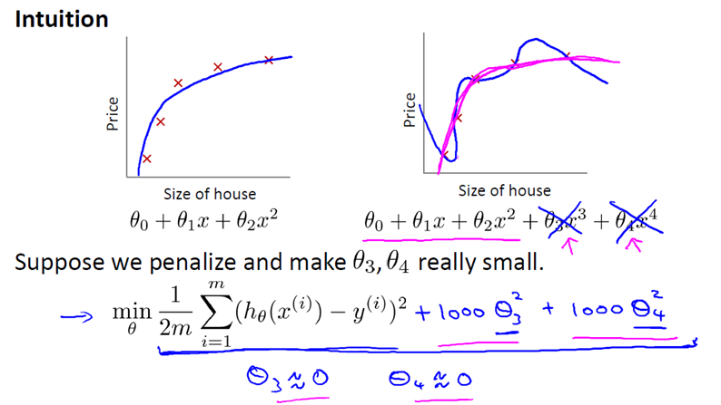

因此，我们最终恰当地拟合了数据，我们所使用的正是二次函数加上一些非常小，贡献很小项（因为这些项的 θ3、 θ4 非常接近于0）。显然，这是一个更好的假设。

### 2

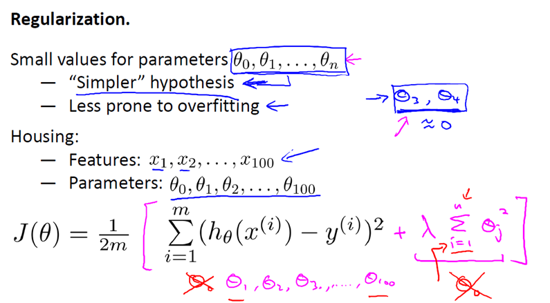

更一般地，这里给出了正规化背后的思路。这种思路就是，如果我们的参数值对应一个较小值的话（参数值比较小），那么往往我们会得到一个形式更简单的假设。

在我们上面的例子中，我们惩罚的只是 θ3 和 θ4 ，使这两个值均接近于零，从而我们得到了一个更简单的假设，实际上这个假设大抵上是一个二次函数。

但更一般地说，如果我们像惩罚 θ3 和 θ4 这样惩罚其它参数，那么我们往往可以得到一个相对较为简单的假设。

> **实际上，这些参数的值越小，通常对应于越光滑的函数，也就是更加简单的函数。因此 就不易发生过拟合的问题。**

我知道，为什么越小的参数对应于一个相对较为简单的假设，对你来说现在不一定完全理解，但是在上面的例子中使 θ3 和 θ4 很小，并且这样做能给我们一个更加简单的假设，这个例子至少给了我们一些直观感受。

来让我们看看具体的例子，对于房屋价格预测我们可能有上百种特征，与刚刚所讲的多项式例子不同，我们并不知道 θ3 和 θ4 是高阶多项式的项。所以，如果我们有一百个特征，我们并不知道如何选择关联度更好的参数，如何缩小参数的数目等等。

因此在正则化里，我们要做的事情，就是把减小我们的代价函数（例子中是线性回归的代价函数）所有的参数值，因为我们并不知道是哪一个或哪几个要去缩小。

因此，我们需要修改代价函数，在这后面添加一项，就像我们在方括号里的这项。当我们添加一个额外的正则化项的时候，我们收缩了每个参数。

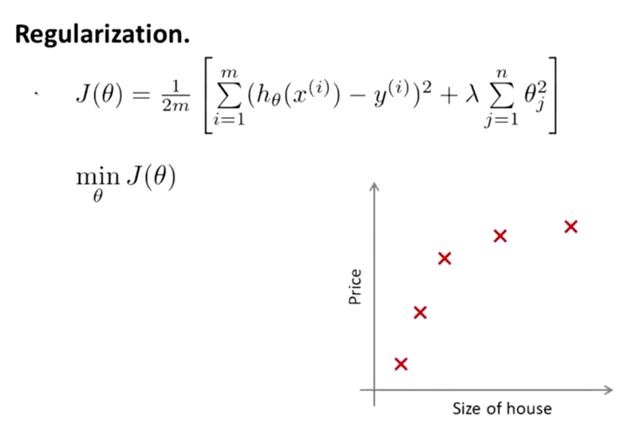

顺便说一下，按照惯例，我们没有去惩罚 θ0，因此 θ0 的值是大的。这就是一个约定从 1 到 n 的求和，而不是从 0 到 n 的求和。但其实在实践中
这只会有非常小的差异，无论你是否包括这 θ0 这项。但是按照惯例，通常情况下我们还是只从 θ1 到 θn 进行正则化。

下面的这项就是一个正则化项

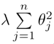
并且 λ 在这里我们称做正则化参数。

> **λ 要做的就是控制在两个不同的目标中的平衡关系。**

**第一个目标就是我们想要训练，使假设更好地拟合训练数据。**我们希望假设能够很好的适应训练集。

**而第二个目标是我们想要保持参数值较小。（通过正则化项）**

而 λ 这个正则化参数需要控制的是这两者之间的平衡，即平衡拟合训练的目标和保持参数值较小的目标。从而来保持假设的形式相对简单，来避免过度的拟合。

对于我们的房屋价格预测来说，我们之前所用的非常高的高阶多项式来拟合，我们将会得到一个非常弯曲和复杂的曲线函数，现在我们只需要使用正则化目标的方法，那么你就可以得到一个更加合适的曲线，但这个曲线不是一个真正的二次函数，而是更加的流畅和简单的一个曲线。这样就得到了对于这个数据更好的假设。

再一次说明下，这部分内容的确有些难以明白，为什么加上参数的影响可以具有这种效果？但如果你亲自实现了正规化，你将能够看到这种影响的最直观的感受。

### 3

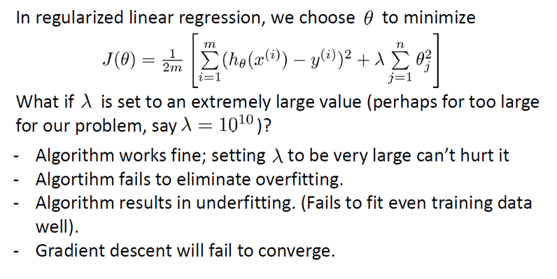

在正则化线性回归中，如果正则化参数值 λ 被设定为非常大，那么将会发生什么呢？

我们将会非常大地惩罚参数θ1 θ2 θ3 θ4 … 也就是说，我们最终惩罚θ1 θ2 θ3 θ4 …  在一个非常大的程度，那么我们会使所有这些参数接近于零。

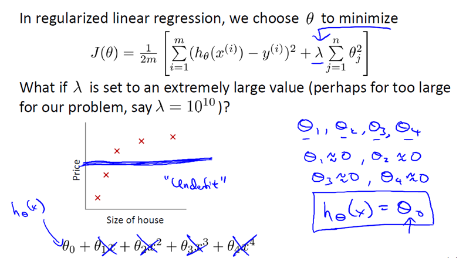

如果我们这么做，那么就是我们的假设中相当于去掉了这些项，并且使我们只是留下了一个简单的假设，这个假设只能表明房屋价格等于 θ0 的值，那就是类似于拟合了一条水平直线，对于数据来说这就是一个欠拟合 (underfitting)。这种情况下这一假设它是条失败的直线，对于训练集来说这只是一条平滑直线，它没有任何趋势，它不会去趋向大部分训练样本的任何值。

这句话的另一种方式来表达就是这种假设有过于强烈的"偏见" 或者过高的偏差 (bais)，认为预测的价格只是等于 θ0 。对于数据来说这只是一条水平线。

因此，为了使正则化运作良好，我们应当注意一些方面，应该去选择一个不错的正则化参数 λ 。当我们以后讲到多重选择时我们将讨论一种方法来自动选择正则化参数 λ  ，为了使用正则化，接下来我们将把这些概念应用到到线性回归和逻辑回归中去，那么我们就可以让他们避免过度拟合了。

## 转载自

https://www.cnblogs.com/nowornever-L/p/6862320.html