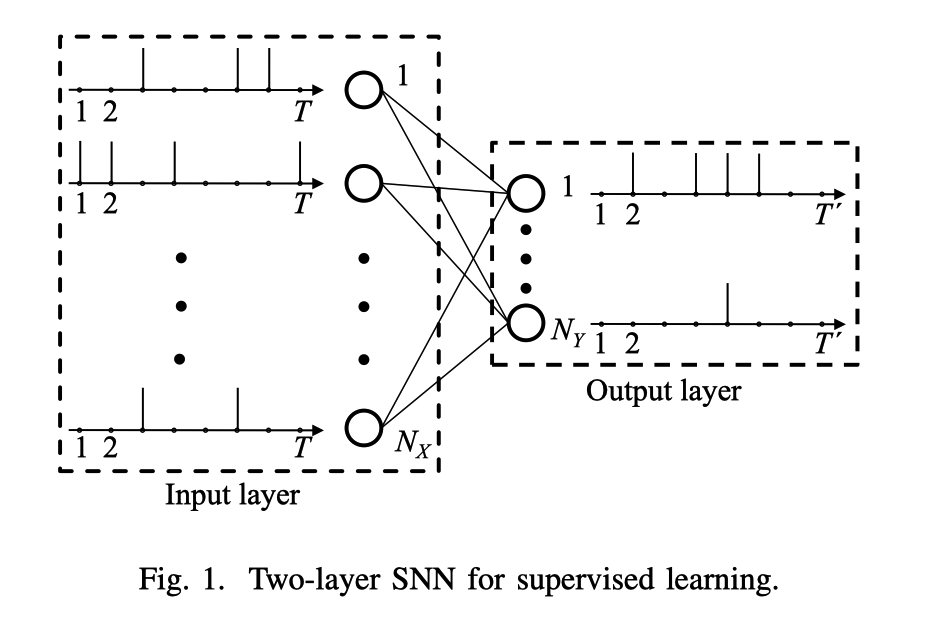
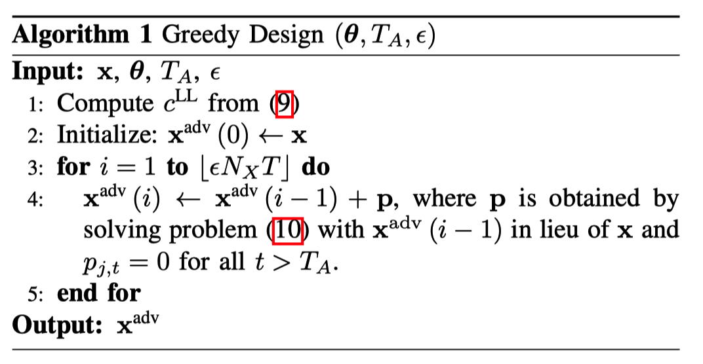

Bagheri, A., Simeone, O., & Rajendran, B. (2018). Adversarial Training for Probabilistic Spiking Neural Networks. *IEEE Workshop on Signal Processing Advances in Wireless Communications, SPAWC*, *2018*-*June*. https://doi.org/10.1109/SPAWC.2018.8446003

在本文中，首次研究了在白盒对抗攻击下通过ML（Maximum Likelihood）训练的SNN的敏感性，并提出了一种可靠的训练机制，该机制被证明可以增强白盒攻击下SNN的性能。

具体来说，作者研究两层SNN，并考虑频率和时间编码，以及速率和第一峰值解码。 结果阐明了在不同编码和解码方案下，SNN对对抗示例的敏感性以及鲁棒训练方法的有效性。

# snn模型

广义线性模型（GLM）神经元的两层SNN的体系结构。（了解即可）

## 网络结构

- SNN采用全连接的方式。

- 在输入（感觉层）具有$N_X$个突触前神经元，在输出层具有$N_Y$个神经元。每个输出神经元都代表某一个分类。 
- 训练流程：
  1. 将输入示例（例如，灰度图像）编码为一组$N_X$个离散时间脉冲序列，每个串具有$T$个样本。 
  2. 输入的脉冲序列被馈送到$N_Y$突触后GLM神经元，该神经元输出离散时间的脉冲序列。 
  3. 然后，解码器根据输出神经元发出的脉冲序列选择图像类别。

## 信息编码

- 频率编码（Rate encoding）：通过生成独立且均匀分布的伯努利矢量，将输入信号的每个条目转换为离散时间脉冲序列。 产生“ 1”（即脉冲）的概率与条目的值成正比。
- 时间编码（Time encoding）：将输入信号的每个条目转换为仅具有一个脉冲的脉冲序列，其时序取决于条目值。 
  - 假设强度-潜伏期编码（intensity-to-latency encoding），时间间隔[1，T]中的脉冲定时线性地取决于输入值，因此最大值会在第一个时间样本上产生脉冲 t = 1，并且最小值映射到最后一次采样t = T中的峰值。

## GLM神经元模型

来自$N_X$个突触前神经元的输入脉冲序列，与所有突触后神经元的输出脉冲序列之间的关系遵循具有规范链接功能的伯努利GLM。（太复杂了不懂！！具体看paper）

## 信息解码

- 频率解码（Rate decoding）：通过选择脉冲数量最多的输出神经元来执行解码。

- 首次-脉冲解码（First-to-spike decoding）：选择与第一次被选择的神经元相对应的类别。

## 最大似然训练（Maximum Likelihood,ML training）

- 频率解码：
  - 对应于正确标签$c∈(1，...，N_Y)$的突触后神经元被分配一个期望的输出脉冲序列$y_c$，其中包含多个脉冲，而全零向量$y_i，i ≠c$， 被分配给其他突触后神经元。
  - 使用ML标准，得到给定的$N_X$输入脉冲序列，一个最大化期望输出脉冲序列的对数概率之和。 （其余看不懂）

- 首次-脉冲解码（First-to-spike decoding）：选择对应于第一个脉冲神经元的类。因此，ML准则最大化了在输出神经元上对应于正确标签的脉冲的概率。

（这些都不重要！！）

# 生成对抗样本

（这个比较重要！！）

在这项工作中，我们基于模型的全部信息（即，参数向量θ、编码和解码策略）来考虑白盒攻击。

在给定示例$(x，c)$的情况下，获得了对抗性脉冲序列$x_{adv}$，其中要使分类者更有可能预测不正确的标签c ′≠c的前提下，扰动$\epsilon$尽可能小。

## 干扰类型

1. 消除攻击：从输入x中消除一个或多个脉冲
2. 增加攻击：将一个或多个脉冲加到输入x上
3. 翻转攻击：一个或多个脉冲被增加或移除（这个与前面两个有啥区别？）

- **干扰大小的衡量：**

  #### 对于所有攻击，通过添加和/或删除的脉冲数量来测量干扰的大小。 从数学上讲，这可以表示为**汉明距离（Hamming distance）**：

  在信息论中，两个等长字符串之间的汉明距离是两个字符串对应位置的不同字符的个数。换句话说，它就是将一个字符串变换成另外一个字符串所需要替换的字符个数。

  如：1011101 与 1001001 之间的汉明距离是 2。
  $$
  d_{H}\left(\mathbf{x}, \mathbf{x}^{\text {adv }}\right)=\sum_{j=1}^{N_{X}} \sum_{t=1}^{T} 1\left(x_{j, t} \neq x_{j, t}^{\text {adv }}\right)
  $$
  其中，$1(·)$表示，若$1(a)$中a为真，则$1(a)=1$；反之，$1(a)=0$

## 干扰类型的选择

为了选择输入x的对抗性干扰，我们考虑给定不正确的目标类别$c'≠c$的可能性的最大化，即找到最不可能是正确类别$c$的类别$c'$。

选择目标类别c'的有效方法是找到在给定模型θ下可能性最小的类别$c^{LL}$。 从数学上讲，对于给定的训练示例$(x，c)$，通过解决以下公式可获得可能性最小的类别：
$$
c^{\mathrm{LL}}=\underset{c^{\prime} \neq c}{\operatorname{argmin}} \quad L_{\boldsymbol{\theta}}\left(\mathbf{x}, c^{\prime}\right)
$$
选择干扰类型：
$$
\begin{array}{ll}
{\max _{\mathbf{p} \in \mathcal{C}}} & {L_{\boldsymbol{\theta}}\left(\mathbf{x}+\mathbf{p}, c^{\mathrm{LL}}\right)} \\
{\text { s.t. }} & {\|\mathbf{p}\|_{0} \leq \epsilon N_{X} T}
\end{array}
$$
其中$\|\mathbf{p}\|_{0}$表示干扰序列的非零元素数。

$\epsilon$控制攻击的强度（比如，2018个输入神经元中选择5个添加干扰）。 

允许从$N_{X} T$个输入样本（即每个输入神经元的$T$个样本）的一部分中添加或删除脉冲。 

以上公式中的的约束集$C$由二进制干扰集合给定：

$C = (0，1)^{N_X T}$，用于加攻击；

$C = (0，-1)^{N_X T}$表示删除攻击；

$C = (0，±1)^{N_X T}$ ，用于翻转攻击。

## 复杂度优化

精确解决方案需要遍历$N_{X} T$个样本的所有可能干扰，复杂度过高。如算法1所述，在$⌊\epsilon N_{X} T⌋$次迭代中的每一次迭代，该方法都会根据攻击类型寻找添加，删除或翻转的最佳脉冲。 

作者通过仅搜索所有输入神经元的前$T_A$个样本，降低了复杂性。

# 强化训练

在基于SGD的训练阶段中，每个训练示例$(x，c)$被替换为从算法1获得的当前迭代θ的对抗示例$x_{adv}$。 

# 实验和分析

- 数据集：标准的USPS数据集。

  - $N_X = 256$，16×16图像中的每个像素对应一个输入神经元。
  - 我们仅关注{1，5，7，9}类，并设置T = K =16。
  - 我们假设测试阶段的最坏情况$T_A=T$。 

- 分析：

  - 对抗性变化$\epsilon$即使将值设置为很小，也可能导致分类准确度显着下降，尤其是在使用攻击性最强的翻转攻击时。

  - 首次-脉冲解码（First-to-spike decoding）对加法和翻转攻击更有抵抗力，但比频率解码难抵御消除攻击。 

    原因：频率解码，选择脉冲数量最多的输出神经元来执行解码。 然而，删除脉冲的操作可能对首次-脉冲解码更有害，因为它可能会阻止正确的神经元脉冲。

  - 在使用首次-脉冲解码的前提下，时间编码被认为比频率编码的弹性差很多。 

    原因：通过删除选定的脉冲，很可能地使时间编码与每个输入神经元的单个脉冲相关联，因此很容易失效。（？）

  - 即使干扰不等于攻击者在测试阶段使用的值，鲁棒训练也可以显着提高SNN分类器的鲁棒性。此外，增加干扰会提高训练后的SNN的鲁棒性，但代价是计算复杂度更高。

  - 即使在训练过程中$T_A≪T$，鲁棒训练仍然可以提高SNN分类的鲁棒性。