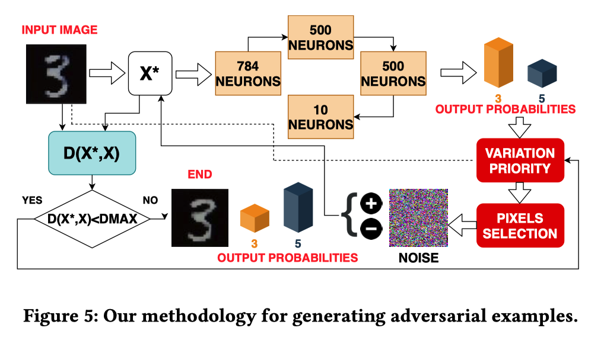
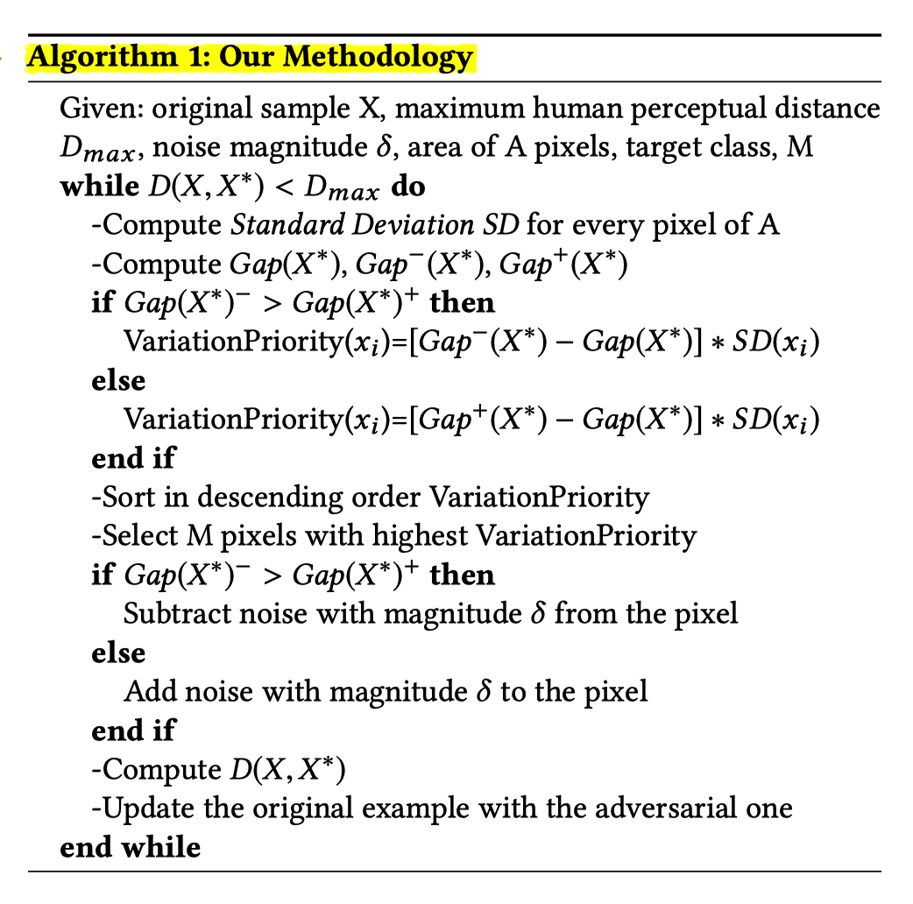

Marchisio, A., Nanfa, G., Khalid, F., Hanif, M. A., Martina, M., & Shafique, M. (2019). *SNN under Attack: are Spiking Deep Belief Networks vulnerable to Adversarial Examples?* http://arxiv.org/abs/1902.01147

使用脉冲深层信仰网络（SDBN，Spiking Deep Belief Networks）进行MNIST数据库分类时，我们表明，在应用于测试图像的数据中毒随机攻击（poisoning random attacks）中，SNN准确度会随着噪声大小而相应降低。 

此外，通过将噪声应用于训练图像，可以提高SDBN的泛化能力。 

我们开发了一种黑盒攻击方法，可通过贪婪算法自动生成无法感知且强大的攻击样本，这是SNN的首创。

深度信念网络（DBN）是多层网络，广泛用于分类问题。

DBN通过堆叠预先训练的受限玻尔兹曼机（RBM），基于能量的模型来实现，该模型由两层神经元组成，一层是隐藏的，一层是可见的，完全对称地连接。 RBM通常在无监督学习的情况下进行训练，以提取保存在隐藏单元中的信息，然后进行有监督的训练以基于这些特征训练分类器[32]。 与DBN相比，添加DBN（SDBN）可以提高能源效率和计算速度。

# 贡献：

1. 首次为SNN生成难以察觉且强大的攻击样本。
   - 评估：攻击应用于具有相同层数和神经元数量的SDBN和DNN。
   - 这种攻击以前仅应用于DNN模型。
2. 调查了SDBN对随机噪声和对抗性攻击的脆弱性，旨在探索与DNN的相似性和差异。
   - 实验表明，将随机噪声应用于给定的SDBN时，其分类精度会通过增加噪声幅度而降低。
3. 攻击SDBN，与DNN相比，输出概率遵循不同的行为：尽管对抗性图像仍然不可察觉，但并非总是能够保证错误分类。

（1）我们分析了在将随机噪声添加到输入图像时，SDBN精度如何变化（第3.2和3.3节）。

（2）当在训练图像上添加随机噪声时，我们评估了SDBN的改进的泛化能力（第3.3节）。

（3）我们开发了一种新的方法来自动创建对抗性示例。 这是应用于SDBN的此类首次攻击（第4节）

（4）我们将我们的方法应用于DNN和SDBN，并评估其不可感知性和鲁棒性（第5节）。

由于人眼对低方差区域中的像素的修改更敏感，因此，为了尽可能地保持不可感知性，最好对高方差区域中的像素进行修改。

# 随机噪声应用于SDBN

## 随机噪声添加到输入对SDBN精度的影响

针对三种不同的图像组合测试了针对不同噪声大小的SDBN的精度：

- 所有测试图像。
  - SDBN的精度会随着噪声幅度的增加而降低
  - 在正态分布随机噪声的情况下更明显。 

- 所有训练图像。（有用）
  - 相反，对于少量噪声δ=0.02，精确度增加。->实际上，在训练样本中加入噪声可以提高神经网络的泛化能力。
  - 但是，如果噪声等于或大于0.1，则精度会显著下降-》这种行为意味着SDBN正在学习噪声而不是有用的信息，因此无法进行分类。
- 同时添加到训练和测试图像
  - 对于低噪声值（主要是在 均匀噪声情况）的精度与基线相似或更高; 
  - 对于大于0.1的噪声量级（对于应用正态噪声的情况，更精确地为0.08），与仅对训练图像施加噪声的情况相比，精度降低的幅度更大。

## 将噪声应用于像素的受限窗口

将正态分布的随机噪声添加到测试图像像素的受限窗口中。 考虑一个4x5像素的矩形，我们分析了两种情况：

- 噪点将应用于图像左上角的20个像素。-》由于噪声只会影响无关的像素，因此精度几乎保持不变。
- 噪声被应用到图像中间的20个像素。-〉精度会显着降低），这是因为代表手写数字（因此对于分类很重要）的一些白色像素会受到噪声的影响。

## 结论

- 正态噪声攻击性强于均匀噪声
- 将少量噪声应用于训练图像，有助于SDBN的泛化。
- 当将噪声应用于受限的像素窗口时，当窗口位于于分类相关的重要位置时，干扰会更有效。

# 生成攻击样本的新方法

## 概念（有意思）

### 不可感知性（imperceptibility）

- 确保人类不会注意到的干扰

- 考虑像素x的面积A = N·N，并按照公式计算像素$x_i$的标准偏差（SD）

  - $$
    S D\left(x_{i}\right)=\sqrt{\frac{x_{k} \epsilon J}{A}\left(x_{k}-\mu\right)^{2}}
    $$

  - μ是属于N·N区域的像素的平均值，J表示构成该区域的一组像素，k是相对于该区域的所有这些像素的索引。 

  - 如果像素具有**较高的标准偏差**，则意味着**添加到该像素的干扰不容易被人眼察觉**。

- 衡量区域D中添加干扰的大小：攻击样本$X_∗$和原始$X$的距离（D）

  - $$
    D\left(X^{*}, X\right)=\sum_{i=1}^{A} \frac{\delta_{i}}{S D\left(x_{i}\right)}
    $$

  - 人眼所能承受的最大干扰可以与距离的值相关联， $D_{max}$

### 健壮性（robustness）

- 许多对抗性攻击方法用于最大化目标类别的概率，以缓解图像的分类器错误分类。 这种方法的主要问题是它们没有考虑等式中定义的类别概率之间的相对差异。

- 在进行图像变换之后，对概率的最小修改可能会使攻击无效。

- 为了提高鲁棒性，期望增加目标类别的概率与其他类别的最高概率之间的差。 换句话说，使间隙函数最大化。间隙函数如下：

- $$
  \operatorname{Gap}\left(X^{*}\right)=P(\text { targetclass })-\max \{P(\text {otherclasses})\}
  $$

## 攻击样本的生成方式（新的）

黑盒+贪心

- 特点：对图像的某些像素执行攻击，从而无需了解网络的洞察力。 

- 目的：迭代使间隙函数最大化，从而使攻击更加鲁棒；同时将样本之间的距离保持在所需阈值以下，以保持不被察觉。

给定使得人眼无法检测到最大扰动允许距离$D_{max}$，该问题可以表示为等式
$$
\arg \max _{X^{*}} \operatorname{Gap}\left(X^{*}\right) | D\left(X^{*}, X\right) \leq D_{\max }
$$

我们选择某个值N，该值对应于N·N个像素的区域A，对其中的M个像素子集执行攻击。

- 流程：

1. 为选定的N·N个像素计算了标准偏差
2. 计算间隙函数Gap，即目标类别的概率与最大概率的其他类别之间的差。
3. 算法决定是对像素施加正噪声还是负噪声
   - 我们为每个像素计算两个参数Gap +（X ∗）和Gap-（X ∗）.Gap +（X ∗）是通过向单个像素加上一个扰动单位而计算出的间隙函数的值，反之。

4. 根据这些值与间隙函数之间的差异，并同时考虑标准偏差，我们计算出变化优先级。
   - 如，如果Gap-（X ∗）大于Gap +（X ∗），则对于该像素，减去噪声将比将其添加到像素更有效。
5. 将变化优先级VariationPriority排序，并为优先级最高的M个像素加入干扰。

该算法通过将原始输入图像替换为创建的对抗图像来开始下一次迭代。当原始示例与对抗示例之间的距离超过最大感知距离时，迭代将终止。

