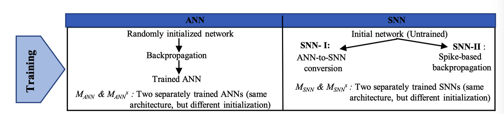
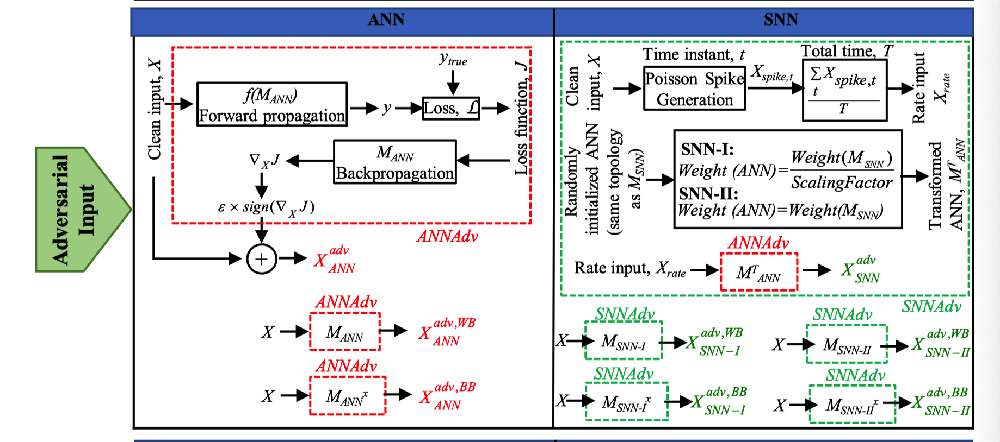
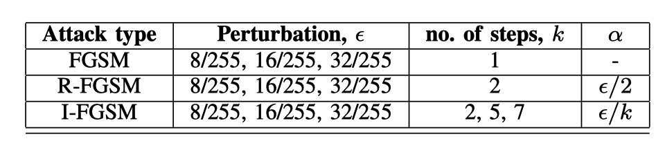
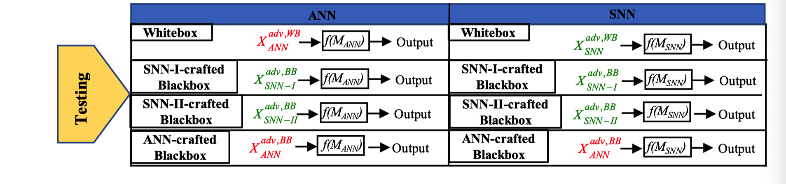
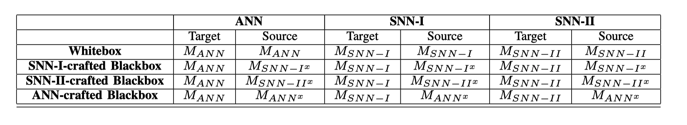

Sharmin, S., Panda, P., Sarwar, S. S., Lee, C., Ponghiran, W., & Roy, K. (2019). A Comprehensive Analysis on Adversarial Robustness of Spiking Neural Networks. *Proceedings of the International Joint Conference on Neural Networks*, *2019*-*July*. https://doi.org/10.1109/IJCNN.2019.8851732

# 贡献

1. 目前没有文献可以生成构造snn对抗性攻击。提出了一种简单的机制，可以根据SNN模型参数生成对抗性输入，而无需在脉冲域中进行任何额外non-trivial 的梯度计算。
2. 用作者提出的方法，进行不同攻击情形下ANN和等效SNN行为的全面定量比较。
   - 黑盒攻击（例如，当攻击者不了解目标模型的参数时），脉冲网络比基于速率的ANN更为健壮。 
   - 白盒攻击中（即，当攻击者完全了解目标模型的参数时），SNN通常会比ANN产生的精度降级更多(higher accuracy degradation)
   - 结论：用作者的方法，snn比ann抢强壮。
3. SNN的对抗性取决于训练机制。基于直接脉冲的反向传播，比基于转换的方法，显示出更好的鲁棒性。

# 攻击对抗基础

文章中主要使用了3种广为人知的生成攻击对抗样本的算法。

$x$      最初干净的输入

$y_{true}$ 与$x$对应的标签（分类）

$x^{a d v}$ 最终生成的对抗样本

1. **无目标快速梯度标志算法 Non-targeted FGSM (Fast Gradient Sign Method)**
   $$
   x^{a d v}=x+\epsilon \operatorname{sign}\left(\nabla_{x} J\left(x, y_{t r u e}\right)\right)
   $$

   $\epsilon$ 一个比原始样本$x$小的多的数

   $J\left(x, y_{t r u e}\right)$ 模型的损失函数
   
   $\nabla_{x} J$ 损失函数相对于原始数据的梯度
   
2. **无目标随机快速梯度标志算法 Non-targeted R-FGSM (Random-step FGSM)**

   与之前的单步梯度计算相比，该方法在最初加入了一个随机的噪声$N\left(O^{d}, I^{d}\right)$
   $$
   \begin{aligned}
   x^{\prime} &=x+\alpha \operatorname{sign}\left(N\left(O^{d}, I^{d}\right)\right) \\
   x^{a d v} &=x^{\prime}+(\epsilon-\alpha) \operatorname{sign}\left(\nabla_{x^{\prime}} J\left(x^{\prime}, y_{t r u e}\right)\right)
   \end{aligned}
   $$
   其中，$\epsilon>\alpha$。该方法用于平滑数据。

3. **迭代快速梯度标志算法 I-FGSM (Iterative FGSM)**

   将迭代应用于FGSM，则得到了以下算法。

   $步长（每次的扰动）\alpha>=\epsilon/k$，其中k为迭代次数。

   其中无目标I-FGSM，损失函数的计算是相对于真实标签$y_{true}$ 的；

   而有目标I-FGSM的算是函数的计算是相对于最相近的分类$y_{ll}$ 的。

   $x_{N}^{a d v}$ 是迭代第N次得到的样本

   ${Clip}_{x, \epsilon}()$ 将参数按照范围$[x-\epsilon,x+\epsilon]$逐元素裁剪到范围

   1. **Non-targeted I-FGSM（无目标）:**
      $$
      \begin{aligned}
      &x_{0}^{a d v}=x\\
      &x_{N+1}^{a d v}={Clip}_{x, \epsilon}\left\{x_{N}^{a d v}+\alpha \operatorname{sign}\left(\nabla_{x} J\left(x_{N}^{a d v}, y_{t r u e}\right)\right)\right\}
      \end{aligned}
      $$

   2. **Targeted I-FGSM（有目标）:**
      $$
      \begin{aligned}&x_{0}^{a d v}=x\\&x_{N+1}^{a d v}={Clip}_{x, \epsilon}\left\{x_{N}^{a d v}+\alpha \operatorname{sign}\left(\nabla_{x} J\left(x_{N}^{a d v}, y_{ll}\right)\right)\right\}\end{aligned}
      $$

# 脉冲神经网络基础

脉冲神经网络SNN使用符合生物特性的IF或者LIF神经元代替人工神经网络中的激活函数（如，Rectified Linear Unit）。LIF模型如下：

$$
\tau \frac{d V_{\operatorname{mem}}}{d t}=-V_{\operatorname{mem}}+w \theta\left(t-t_{k}\right)
$$
$V_{mem}$ 是膜电位

τ是$V_{mem}$ 衰减的时间常数

w是突触权重

$\theta\left(t-t_{k}\right)$代表时刻t_k​的脉冲

1. **基于ANN转化的SNN(SNN-I)**

   这里将IF神经元等同于ANN中的激活函数ReLU。

   调整突触权重（“权重归一化”）或神经元阈值（“阈值平衡”），以实现从ANN到SNN的无损转换。与ANN相比，以这种方式训练的SNN的准确性很高。

2. **基于直接脉冲训练的SNN(SNN-II)**

   这里使用LIF神经元作为基本模块。

   前向传播中，将从输入像素生成的泊松分布的脉冲序列送到网络。 如果超过阈值，则在时间t，神经元输入处的累积加权没冲将触发输出没冲。 每一层的神经元都会根据从上一层收到的输入尖峰进行此过程。

   为了在脉冲域中进行反向传播，我们需要神经元的微分传递函数。 为此，根据以下方程式，通过低通滤波脉冲序列来确定脉冲神经元的激活。

   $$
   \text {Activation, } a(t)=\frac{1}{T} \sum_{k=1}^{t} \exp \left(-\frac{t-t_{k}}{\tau}\right)
   $$
   时间常数τ决定了神经元激活的衰减率。 T是总时间。 $t_k$是第k个尖峰的时刻。

   相对于权重的误差梯度需要计算神经元激活A相对于神经元的净输入的导数，这近似于以下方程：

   $$
   \frac{\delta a}{\delta n e t}=\frac{1}{V_{t h}}\left(1+\frac{\delta a}{\delta t}\right)
   $$
   其中，$V_{th}$代表阈值。net是神经元输入峰值的累积加权和，t是时刻。

# 实验

数据集：CIFAR-10

对照网络：VGG-9人工神经网络（ANN）、脉冲神经网络（SNN）

## 训练：

总共得到6个网络：

- 对ANN的训练：

  - VGG-9ann的训练采用200个阶段；
  - 初始学习率为0.09，为了保证训练过程中损失函数的逐渐减小，在81和122次迭代中（也称为学习率退火）减少10倍。
  - 最终得到两个相同结构但是初始化不同的网络$M_{ANN}和M_{ANN}^x$

- 对SNN的训练：

  - 基于转化的SNN-I

    - 最终得到两个相同结构但是初始化不同的网络$M_{SNN-I}和M_{SNN-I}^x$

  - 基于脉冲训练的SNN-II

    正向传播期间的总时间步数为70。训练分125个阶段进行，其中在第70和100个阶段降低了学习率。

    - 最终得到两个相同结构但是初始化不同的网络$M_{SNN-II}和M_{SNN-II}^x$

## 对抗样本的生成

- **ANN：**

使用四种不同的方法从训练模型生成对抗性输入：

（i）无目标FGSM，

（ii）无目标R-FGSM，

（iii）无目标I-FGSM和

（iv）有目标I-FGSM。

扰动$\epsilon$ 取 8/255, 16/255, 32/255 和 64/255

迭代FGSM中，取2步、5步和7步进行实验。

下图为试验参数：

- **用SNN生成对抗样本**（！！！这里是本文的贡献）

  这里作者提出一个简单的框架，用于snn生成对抗样本：

  1. 对具有相同网络拓扑结构的神经网络模型NN′进行随机初始化。SNN模型是独立训练的（$M_{SNN}$）。
  2. 映射神经网络权值矩阵，并用$M_{SNN}$的学习权值覆盖。
  3. 干净数据集的Poisson脉冲序列生成频率编码的输入$X_{rate}$。
  4. 采用$X_{rate}$和NN模型生成FGSM对抗性输入

  $$
  X_{a d v}^{i}=A N N A d v\left(X_{r a t e}^{i}, N N^{\prime}, \epsilon\right)
  $$

## 测试

对抗性输入通过网络的前向函数，并与真实标签进行比较，计算出相应的对抗性测试精度和损失。

上图为测试的模型和输入对抗样本源的所有组合。

- 白盒：每个目标模型（$M_{ANN}$、$M_{SNN-I}$和$M_{SNN-II}$）都受到各自目标网络生成的对抗输入的攻击。
- SNN-I生成的对抗样本的黑盒攻击：所有目标模型都受到来自单个SNN-I模型$M_{SNN-I^x}$ 的输入的攻击。
- SNN-II生成的对抗样本的黑盒攻击：所有目标模型都受到来自单个SNN-II模型$M_{SNN-II^x}$ 的输入的攻击。
- ANN生成的对抗样本的黑盒攻击：所有目标模型都受到来自单个ANN模型$M_{ANN^x}$ 的输入的攻击。

## 结论

1. ANN与SNN
   - SNN比ANN具有更强的对抗攻击能力，导致SNN在白盒场景中比ANN具有更高的准确性损失。
   - 由于snn固有的随机时间动力学特性，它在黑箱环境下比ann具有更强的鲁棒性。

2. SNN的鲁棒性很大程度上取决于相应的训练机制——通过基于脉冲的反向传播训练的SNN比在ANN到SNN转换规则所获得的SNN更具对抗性