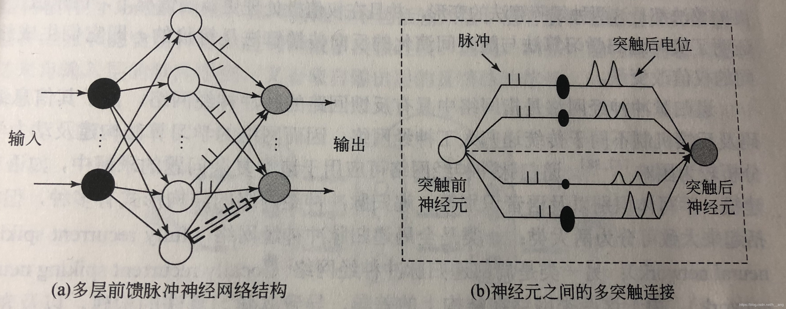
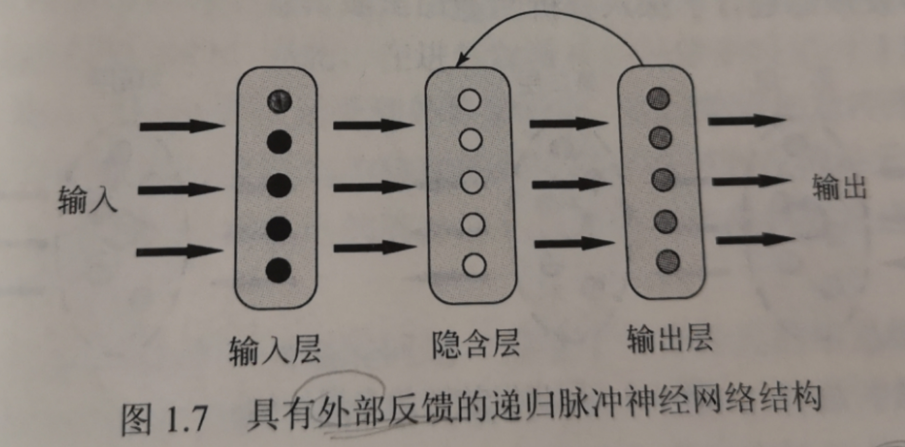

以下为脉冲神经网络的研究现状。

主要讨论脉冲神经网络的拓扑结构、信息的脉冲序列编码方法、脉冲神经网络的学习算法和进化方法等。

# 一. 脉冲神经网络的拓扑结构

同传统的人工神经网络一样，脉冲神经网络同样分为三种拓扑结构。它们分别是**前馈型脉冲神经网络**（feed-forward spiking neural network）、**递归型脉冲神经网络**（recurrent spiking neural network）和**混合型脉冲神经网络**（hybird spiking neural network）。

1. ## 前馈型脉冲神经网络

  在多层前馈脉冲神经网络结构中，网络中的神经元是分层排列的，输入层各神经元的脉冲序列表示对具体问题输入数据的编码，并将其输入脉冲神经网络的下一层。最后一层为输出层，该层各神经元输出的脉冲序列构成网络的输出。输入层和输出层之间可以有一个或者多个隐藏层。
  
  此外，在传统的前馈人工神经网络中，两个神经元之间仅有一个突触连接，而脉冲神经网络可采用**多突触连接的网络结构**，两个神经元之间可以有多个突触连接，每个突触具有不同的延时和可修改的连接权值。多突触的不同延时使得突触前神经元输入的脉冲能够在更长的时间范围对突触后神经元的脉冲发放产生影响。突触前神经元传递的多个脉冲再根据突触权值的大小产生不同的突触后电位。

2. ## 递归型脉冲神经网络

  递归型神经网络不同于多层前馈神经网络和单层神经网络，网络结构中具有反馈回路，即网络中神经元的输出是以前时间步长上神经元输出的递归函数。递归神经网络可以模拟时间序列，用来完成控制、预测等任务，其反馈机制一方面使得它们能够表现更为复杂的时变系统；另一方面也使得有效学习算法的设计及其收敛性分析更为困难。传统递归人工神经网络的两种经典学习算法分别为**实时递归学习**（real-time recurrent learning）算法和**随时间演化的反向传播**（backpropagation through time）算法，这两种算法都是递归地计算梯度的学习算法。
  
  递归脉冲神经网络是指**网络中具有反馈回路的脉冲神经网络**，由于其信息编码及反馈机制不同于传统递归人工神经网络，由此网络的学习算法构建及动力学分析较为困难。递归脉冲神经网络可应用于诸多复杂问题的求解中，如语言建模、手写数字识别以及语音识别等。递归脉冲神经网络可分为两大类：**全局递归脉冲神经网络**（fully recurrent spiking neural network）；另一类是**局部脉冲神经网络**（locally recurrent spiking neural network）。

3. ## 混合型脉冲神经网络

  混合型脉冲神经网络即包括前馈型结构，又包含递归型结构。

# 二. 信息的脉冲序列编码方法

从神经科学的角度来看，第二代人工神经网络是一种基于“发放频率”的神经元计算方式。随着研究的深入，神经科学家指出生物神经系统采用神经元的脉冲时序来编码信息，而不仅仅是用神经元脉冲的“发放频率”来编码信息。实际上，**神经元的脉冲发放频率不能完全捕获脉冲序列中包含的信息**。例如，已经发现初级听觉皮层神经元群体能在短时间内通过分组相邻脉冲来协调动作电位的相对时间，并没有改变每秒发放的脉冲数量，这样，神经元甚至可以在平均发放频率没有改变的情况下给出特定的刺激信号。

更具有生物可解释性的脉冲神经网络，**采用精确定时的脉冲序列来编码神经信息**。神经网络内部的信息传递是由脉冲序列完成的，脉冲序列是由离散的脉冲时间点组成的时间序列，因此，在进行脉冲神经网络的模拟与计算时，包含以下步骤：

- 当输入数据或神经元受到外界刺激时，经过特定的脉冲序列编码方法，可**将数据或外界刺激编码成特定的脉冲序列**；

- **脉冲序列在神经元之间传递并经过一定的处理，处理之后将输出的脉冲序列通过特定的解码方法进行解码并给出具体的响应**。

对于神经信息的脉冲序列编码问题，借鉴生物神经元的信息编码机制，研究者提出了许多脉冲神经网络的脉冲序列编码方法。例如，首脉冲触发时间编码方法、延迟相位编码方法、群体编码方法等。

# 三. 脉冲神经网络的学习算法

学习是人工智能领域的核心问题，对于SNN来说，基于脉冲时间层次的学习方法研究，对于通过理论模型来验证生物神经系统的信息处理和学习机制是必须的。通过生物可解释的方式建立人工神经系统，科学家希望可以通过神经科学和行为实验来达到预期目的。**大脑中的学习可以理解为突触连接强度随时间的变化过程，这种能力称为突触可塑性**（synaptic plasticity）。脉冲神经网络的学习方式主要包括无监督学习（unsupervised learning）、监督学习（supervised learning）和强化学习（reinforcement learning）等。

1. ## 无监督学习算法

  无监督学习算法在人类和动物的学习中占据主导地位，人们通过观察能够发现世界的内在结构，而不是被告知每一个客观事物的名称。人工神经网络无监督学习算法的设计主要是针对无标签数据集的训练，要求应用无监督学习规则对神经网络中的连接权值或结构进行自适应的调整。也就是说，在没有“教师”信号的监督下，神经网络必须自己从输入数据中发现规律性（如统计特征、相关性或类别等），并通过输出实现分类或决策。一般来说，**只有当输入数据集中存在冗余性时，无监督学习才有意义**，否则，无监督学习不能很好地发现输入数据中的任何模式或特征，即冗余性提供了知识。

  脉冲神经网络的无监督学习算法大多是借鉴传统人工神经网络的无监督学习算法，是**在Hebb学习规则**不同变体的基础上提出的。神经科学的研究成果表明，生物神经系统中的脉冲序列不仅可引起神经突触的持续变化，**并且满足脉冲时间依赖可塑性**（spike timing-dependent plasticity，STDP）机制。**在决定性时间窗口内，根据突触前神经元和突触后神经元发放的脉冲序列的相对时序关系，应用STDP学习规则可以对突触权值进行无监督方式的调整。**

2. ## 脉冲神经网络的监督学习

  脉冲神经网络的监督学习是指对于给定的多个输入脉冲序列和多个目标脉冲序列，寻找脉冲神经网络合适的突触权值矩阵，使神经元的输出脉冲序列与对应的目标脉冲序列尽可能接近，即两者的误差评价函数最小。对于脉冲神经网络来说，神经信息以脉冲序列的形式表示，神经元内部状态变量及误差函数不再满足连续可微的性质，构建有效的脉冲神经网络监督学习算法非常困难，同时也是该领域的一个重要的研究方向。

  根据监督学习所采用的基本思想不同，可以将现有的监督学习算法分为三类：

  - 基于**梯度下降**的监督学习算法的基本思想是**利用神经元目标输出与实际输出之间的误差以及误差反向传播过程，得到梯度下降计算结果作为突触权值调整的参考量，最终减小这种误差**。基于梯度下降的监督学习算法是一种数学分析方法，在学习规则的推导过程中，要求神经元模型的状态变量必须是有解析的表达式，主要采用固定阈值的线性神经元模型，如**脉冲响应模型**（spike response model）和**Integrate-and-Fire神经元模型**等。
  - 基于**突触可塑性**的监督学习算法的基本思想是**利用神经元发放脉冲序列的时间相关性所引起的突触可塑性机制，设计神经元突触权值调整的学习规则**，这是一种具有生物可解释性的监督学习。

  - 基于**脉冲序列卷积**的监督学习算法**通过脉冲序列内积的差异构造脉冲神经网络的监督学习算法，突触权值的调整依赖于特定核函数的卷积计算**，可实现脉冲序列时空模式的学习。

3. ## 脉冲神经网络的强化学习

  强化学习是从环境状态到行为映射的学习，以使智能体行为从环境中获得的累积奖赏值最大。基于生物启发的学习机制，人工神经网络强化学习的研究重点在于探索智能体的自适应优化策略，是近年来神经网络和智能控制领域的主要方法之一。强化学习关注的是智能体如何在环境中采取一系列行为，通过强化学习，一个智能体应该知道在什么状态下应该采取什么行为。可以看到，强化学习和监督学习的区别主要在于以下两点：

  强化学习是**试错学习**，由于没有直接的“教师”指导信息，智能体要不断与环境交互，**通过试错的方式来获得最佳策略；**
  延迟回报，强化学习的指导信息很少，而且往往是在事后（最后一个状态）才给出的，这就导致了一个问题，即获得正回报或者负回报以后，如何将汇报分配给前面的状态。

# 四. 脉冲神经网络的进化方法

进化算法（evolutionary algorithm）是模拟生物进化过程的计算模型，是一类基于自然选择和遗传变异等生物进化机制的全局性概率搜索算法，主要包括**遗传算法**（genetic algorithm）、**进化规划**（evolutionary programming）和**进化策略**（evolutionary strategy）等。虽然这些算法在实现方面具有一些差别，但它们具有一个共同的特点，即都是借助生物进化的思想和原理来解决实际问题的。

将进化算法与脉冲神经网络有机结合起来，研究者开辟了**进化脉冲神经网络**（evolutionary spiking neural network）的研究领域，以提高对复杂问题的求解能力。进化脉冲神经网络可以作为自适应系统的一种一般性框架，**在没有人为干预的情况下系统自适应调整神经元的参数、连接权值、网络结构和学习规则**。

来自**脉冲神经网络原理**及应用一书

# 参考资料

博客：https://blog.csdn.net/h__ang/article/details/90513919

书籍：《脉冲神经网络原理及应用》