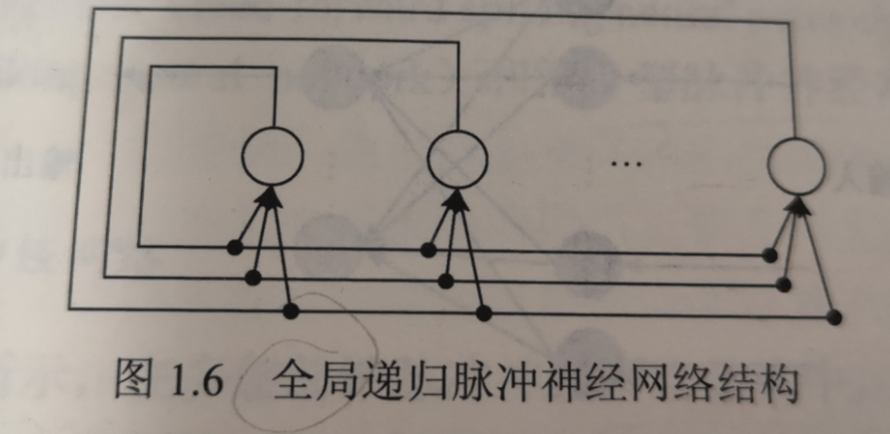

以下为脉冲神经网络的研究现状。

主要讨论脉冲神经网络的拓扑结构、信息的脉冲序列编码方法、脉冲神经网络的学习算法和进化方法等。

# 一. 脉冲神经网络的拓扑结构

同传统的人工神经网络一样，脉冲神经网络同样分为三种拓扑结构。它们分别是**前馈型脉冲神经网络**（feed-forward spiking neural network）、**递归型脉冲神经网络**（recurrent spiking neural network）和**混合型脉冲神经网络**（hybird spiking neural network）。

1. ## 前馈型脉冲神经网络

  在多层前馈脉冲神经网络结构中，网络中的神经元是分层排列的，输入层各神经元的脉冲序列表示对具体问题输入数据的编码，并将其输入脉冲神经网络的下一层。最后一层为输出层，该层各神经元输出的脉冲序列构成网络的输出。输入层和输出层之间可以有一个或者多个隐藏层。

此外，在传统的前馈人工神经网络中，两个神经元之间仅有一个突触连接，而脉冲神经网络可采用**多突触连接的网络结构**，两个神经元之间可以有多个突触连接，每个突触具有不同的延时和可修改的连接权值。多突触的不同延时使得突触前神经元输入的脉冲能够在更长的时间范围对突触后神经元的脉冲发放产生影响。突触前神经元传递的多个脉冲再根据突触权值的大小产生不同的突触后电位。

2. ## 递归型脉冲神经网络

  递归型神经网络不同于多层前馈神经网络和单层神经网络，网络结构中具有反馈回路，即网络中神经元的输出是以前时间步长上神经元输出的递归函数。递归神经网络可以模拟时间序列，用来完成控制、预测等任务，其反馈机制一方面使得它们能够表现更为复杂的时变系统；另一方面也使得有效学习算法的设计及其收敛性分析更为困难。传统递归人工神经网络的两种经典学习算法分别为**实时递归学习**（real-time recurrent learning）算法和**随时间演化的反向传播**（backpropagation through time）算法，这两种算法都是递归地计算梯度的学习算法。

递归脉冲神经网络是指**网络中具有反馈回路的脉冲神经网络**，由于其信息编码及反馈机制不同于传统递归人工神经网络，由此网络的学习算法构建及动力学分析较为困难。递归脉冲神经网络可应用于诸多复杂问题的求解中，如语言建模、手写数字识别以及语音识别等。递归脉冲神经网络可分为两大类：**全局递归脉冲神经网络**（fully recurrent spiking neural network）；另一类是**局部脉冲神经网络**（locally recurrent spiking neural network）。

# 参考资料

博客：https://blog.csdn.net/h__ang/article/details/90513919

书籍：《脉冲神经网络原理及应用》