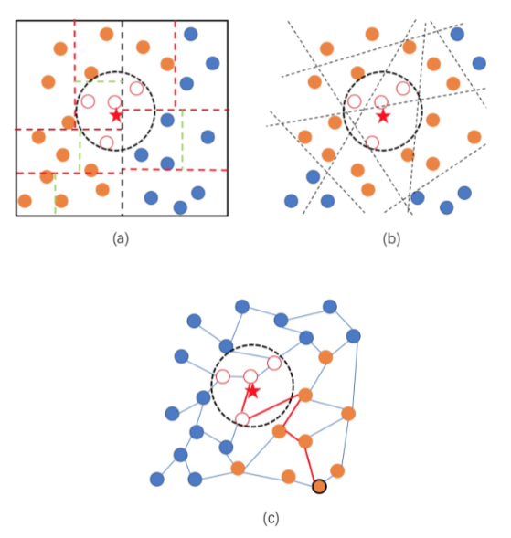
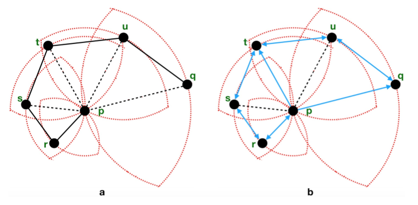
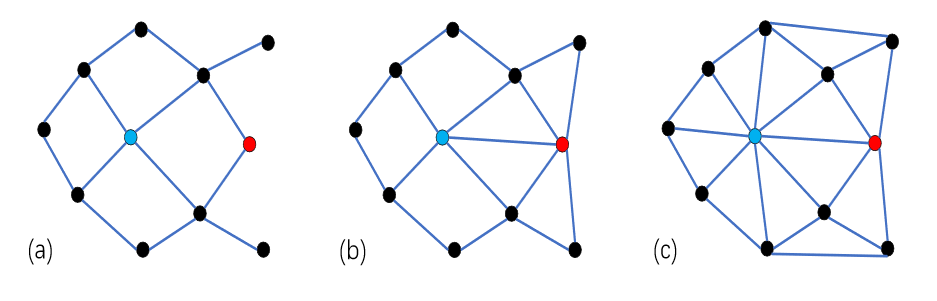
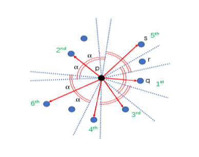
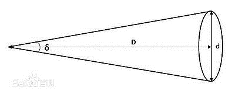
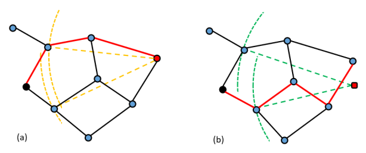
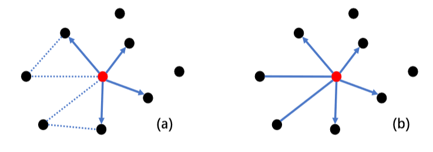
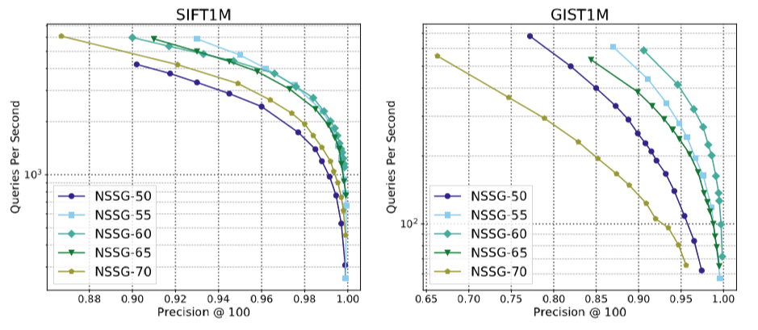

最近阅读了论文《Satellite System Graph: Towards the Efficiency Up-Boundary of Graph-Based Approximate Nearest Neighbor Search(卫星系图：接近基于图的近似最近邻搜索效率的上界)》

接下来做简单的介绍：

# 背景

高维空间中的近似最近邻搜索Approximate nearest neighborn searching（ANNS）在数据库、信息检索、数据挖掘和机器学习中是必不少的。

## ANNS近似最近邻搜索问题

### ANNS的主要思想

搜索可能是近邻的数据项而不再只局限于返回最可能的项目，在牺牲可接受范围内的精度的情况下提高检索效率。

### ANNS的分类

- 基于树的方法（如图a）
  随机KD树、R树
  
- 基于散列的方法（如图b）
  局部敏感哈希（LSH）、光谱散列
  
- 基于量化的方法
  产品量化、复合量化
  
- 基于图的方法（如图c）
  NSW、HNSW、FANNG、NSG
  
  

其中NSG与SSG都是由同一位作者提出的，两种图的主要思想和构建方法都非常类似，而且SSG的很多改进点都由NSG的缺点引出的。所以，了解NSG有利于SSG的理解。那么下面就来介绍以下NSG等相关知识。

## 相关研究

### 单调搜索网络MSNET与单调相对领域图MRNG

- **单调路径Monotonic Path**
  在给定空间的有限点集S中，p、q为在集合中的两点，且G为定义在S上的图。其中

$$
v_1,v_2...v_k(v_1=p,v_k=q)
$$

​		为从点p到q的路径上的点，且∀i = 1,...,k−1,δ(,q) > δ(+1,q)随着i的增大， 与q的距离越来越近。

- **单调搜索网络Monotonic Search Networks (MSNET)**
  在给定空间的有限点集S中，任意两点p、q之间至少存在一条单调路径。
  **特性：**
  强连通图，确保图的连接性
  不需要回溯，路径中每一步都更加接近终点q

- **单调搜索网络MSNET与单调相对领域图MRNG**
  相对邻域图 Relative Neighborhood Graph(RNG)
  在给定空间的有限点集S中，当且仅当任意两点p、q的之间的区域 中不包含集合S中的任何点。
  其中，
  $$
  lune_{pq}= B(p,δ(p,q)) ∩ B(q,δ(p,q))
  $$
  
- **单调相对邻域图Monotonic Relative Neighborhood Graph (MRNG)**
  **定义：**在给定空间的有限点集S中，满足：
  任意两点p、q的区域中不包含集合S中的任何点。（RNG的定义）
  或者，若区域中存在的点r，但不属于MRNG
  **定理：**
  在给定空间的有限点集S中，在 S 上定 义的 MRNG 是 MSNET 。

- 例子：

  图a为RNG，图b为MRNG
  图a中，pq之间的路径存在绕行；图b中，从任何节点到另一节点至少存在一个单调路径。

  

### NSG存在的一些缺陷

- **MSNET过于稀疏，导致搜索性能较差**
  基于ANN的搜索复杂度主要取决于结点的出度、起点到终点的路径长度
  (a)(b)(c)分别为MSNET图族的三种不同的图，且(a)->(c)：稀疏度降低
  (a)(b)(c)图分别需要7、5、8次计算。
  **结论：**并不是图越稀疏、或者越稠密效率越高，而是存在“最优稀疏度

  **解决途径：**图的理论定义->新的msnet图ssg

  利用参数描述边缘之间的最大角度，控制图的系数性，探索最佳出度。
  
  
  
- **规模较大的实际应用中，nsg索引的复杂度依然很高，限制了它的扩展和搜索性能**

  **解决途径：**索引算法的设计，产生近似ssg，具有较低的时间复杂度，有利于应用于大规模的项目。
  
  

# 解决办法-SSG

为了解决NSG的一些缺陷，作者提出了新的MSNET图SSG(Satellite System Graph卫星系图)。

## SSG的定义

- 卫星系图Satellite System Graphs (SSG)
  定义在有向边集S上，满足，对于任何$\vec{pq} $，  $\vec{pq} $∈ SSG当且仅当Cone($\vec{pq} $,α) ∩B(p,δ(p,q))∩S = ∅ 或者∀r ∈ Cone($\vec{pq} $,α) ∩B(p,δ(p,q))∩S ≠ ∅，但 ∉SSG。(**大白话**： pq ∈ SSG当且仅当以pq为轴，α为角直径的圆锥和以p为圆心，pq为半径的球体和有向边集S的交集为空

  或者该交集中存在点r，但是有向边pr不属于ssg。)
  
- δ(p,q)表示pq之间的距离

- B(p,δ(p,q))表示一p为圆心，pq为半径的开球

- α ≤ 60◦

- Cone($\vec{pq} $,α) 表示
  在欧几里得空间中，对于任意，Cone(,α) 是以为轴，2α为角直径的圆锥。
  δ：角直径
  d：物体直径
  D：物体距离

  

## 构建朴素SSG索引

对于集合S中每一个 p ∈ S 执行以下过程:

1. 计算集合S中除p点以外的所有点q(q ∈ S−{p})和p的距离pq

2. 按照pq的距离，升序对集合q ∈ S−{p}进行排序，形成列表C

3. 按顺序检查是否满足SSG的定义，满足则可加入SSG

   

- **例子：**
  在2维空间中，首先计算与p点的距离，并升序排序。按顺序检查有向边是否可以加入SSG。
  - 首先看q点，Cone($\vec{pq} $,α) ∩B(p,δ(p,q))∩S = ∅ ，所以有向边pq加入SSG。其他的以此类推。
  - 再看r点，检查它的顺序肯定在q之后，s之前。 q ∈ Cone($\vec{pq} $α) ∩B(p,δ(p,r))∩S ≠ ∅ ，且SSG，所以不能加入SSG。
  - 看s点， r ∈ Cone(,α) ∩B(p,δ(p,s))∩S ≠ ∅ ，但，所以可以加入SSG。

## SSG的ANNS特性分析

### 数据库内查询和非数据库内查询

- **数据库内查询**
  返回的是数据库中存在的数据

- **非数据库内查询**
  返回的是与查询点邻近的数据

  

- 例子
  如上图，设黑点为起始点，红点为查询点。

  使用贪婪搜索从黑点开始搜索，下一跳应选择黑点的邻居中距离红点最近的点。图a中黑点斜上方的点距离红色查询点更近，而图b中黑点斜下方的点距离红色查询点更近。接着两张图上的查询沿着不同的路径（红色路径）得到了相同的返回结点（红色路径的终点）。

  所以，虽然起始点和最终得到的结果完全相同，但是由于查询点与当前点的距离不同，导致使用贪婪搜索，得到的搜索路径完全不同。
### 数据库内查询

- **定理1**：SSG属于MSNET图族

- 与同为MSNET图族的MRNG比较：
  图(a)为MRNG，图(b)为SSG

  - 实验显示MRNG的平均出度小于SSG，但平均搜索路径长于SSG。
  - 由于MRNG中三角形的最长边必须被移除，所以如图a虚线部分是空白的。而且根据MRNG的定义，对于确定的数据集S，MRNG是确定的，不能根据不同情况进行调节。
  - SSG通过边之间的夹角进行裁边，使得边缘分布更加均匀，减少空白区域。通过改变边缘之间的最大夹角α可以控制图的稀疏程度，由此可以**根据不同的数据分布调节α**，并找到搜索路径长度和出度的平衡点。	

  

### 非数据库内查询

- **定理3**：对于随机分布在欧几里得空间上的有限集S，任意不属于S的查询q，搜索路径上的每一步都是单调的概率为 0.5 +e ,0 < e ≤ 0.5(单调的概率大于0.5)。其中，当 SSG的α ≤ 30◦时 e=1(一定是单调的)。
- 与同为MSNET图族的MRNG比较：
  - 从定义来看SSG相对于MRNG的优势与α的大小有关：
    - 当α = 60◦时，搜索路径中的任意一步违反单调性的概率小于0.5
    - 当α ≤ 30◦时，在数据库和非数据库查询的情况下，保证搜索路径一定是单调的。
   - 同时，对于SSG来说，α=60°比α≤30°稀疏很多。对于在非数据库上的查询来说，出度和单调性之间需要权衡（α大，出度小，单调性的概率下降）。不同分布的数据集，最合适的α不同。
   - 而MRNG以及它之前的准备工作中（例如生成kNN图），都没有角度约束，所以不具备以上属性。

### 总结：

1. SSG可以通过α控制图的稀疏度，针对不同数据集，调节α，生成较为合适的图结构。
2. 在非数据库查询中，比MRNG更具有理论上的普遍性。

## SSG的实用变体NSSG（ Navigating SSG ）

可导航卫星系图NSSG

### 生成索引主要步骤

1. **从少量候选集中选择点的邻居**：首先建立kNN图。候选集从kNN图上对应点的邻居、邻居的邻居中产生。（NSG：使用贪婪搜索，选择起始点p到q之间搜索路径上的所有点加入候选集）
2. **从候选集中选则边缘的时候使用SSG选边策略**
   - 且仅仅在此步骤中应用SSG选边策略（参见，建立朴素SSG过程，满足SSG定义即可加入SSG图）
   - 在最终构成的图上，设置最大度，防止个别点的度特别大。
3. **确保图的连通性**：DFS扩展算法，添加少量的边，确保图单方向的连通性。（与NSG中此部分类似）
   1. 随机选择m个导航点（NSG仅选择一个中心点作为导航点）->相比NSG更能适应不同分布的图
   2. 从每一个导航点出发DFS，分别生成深度优先搜索树。当DFS搜索终止时，把没有链接到树的节点，链接到它们最近的邻居。（同NSG）

**P.s.虽然SSG的定义要求0°α60°，但是实际操作中可以将α的范围扩展到0°~90°**

### 搜索

- 与其他基于图的搜索一样，使用贪婪搜索进行搜索。
- 相比NSG的改动：将m个导航点按照与查询点q的距离从小到大排序，从距离查询点q最近的导航点开始查询。

# 实验分析

## 搜索性能对比

- **在规模大的数据集上优势明显**
  SSG对于数据规模不敏感，在高维度上与其他算法差距越来越大

- DPG(Diversified Proximity Graph)和SSG都是使用角度进行选边的算法，但是尤其是在数据规模大的情况下，DPG的性能远低于SSG。原因如下：
  DPG不是MSNET
  DPG太密集，存在过多无效边

- 由于**NSSG的选边策略为搜索路径带来了跟多有效边**，虽然度变大了，但使得搜索路径中的跳数变少，进而使得NSSG的性能优于NSG和HNSW。

## 索引生成性能对比

- **索引尺寸：**
  由于NSSG和NSG的最大度较小，所以索引尺寸是最小的。虽然HNSW的最大度与前者相同，但是由于HNSW是分层的，所以它的索引尺寸会很大。

- **建立索引的时间：**
  NSSG建立索引的时间仅次于KGraph，因为KGraph用于建立NSSG的第一步：生成kNN图。但是NSSG的搜索性能远好于KGraph。

- 最耗时的部分是建立kNN图。可以通过在GPU上生成索引或者使用其他更快的算法代替。

## 参数对性能的影响

- α=60°时，搜索性能最好

