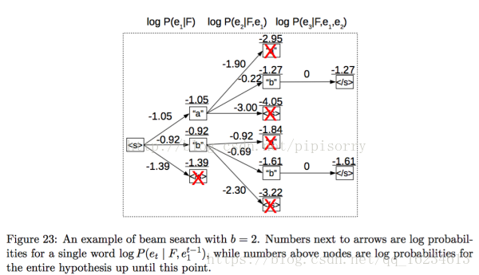

## 1.概念

**Beam Search（集束搜索）**：是一种启发式图搜索算法，在图的解空间比较大的情况下，为了减少搜索所占用的空间和时间，在每一步深度扩展的时候，剪掉一些质量比较差的结点，保留下一些质量较高的结点。

 好处：减少了空间消耗，并提高了时间效率。

（补充说明：启发式搜索是利用问题拥有的启发信息来引导搜索，达到减少搜索范围、降低问题复杂度的目的）

------

## 2.过程

**Beam Search（集束搜索）：**使用广度优先策略建立搜索树在树的每一层，按照启发代价对节点进行排序，然后仅留下预先确定的个数（Beam Width-集束宽度）的节点，仅这些节点在下一层次继续扩展，其他节点就被剪掉了。

（注意：如果集束宽度无穷大，那该搜索就是广度优先搜索）

步骤如下：

1.将初始节点插入到list中，

2.将该节点出堆，如果该节点是目标节点，则算法结束；

3.否则扩展该节点，取集束宽度的节点入堆。然后到第二步继续循环。

4.算法结束的条件是找到最优解或者堆为空。

------

## 3.图解

集束搜索可以认为是维特比算法的贪心形式，在维特比所有中由于利用动态规划导致当字典较大时效率低，而集束搜索使用beam size参数来限制在每一步保留下来的可能性词的数量。集束搜索是在测试阶段为了获得更好准确性而采取的一种策略，在训练阶段无需使用。

假设字典为[a,b,c]，beam size选择2，则如下图有：

1：在生成第1个词的时候，选择概率最大的2个词，那么当前序列就是a或b

2：生成第2个词的时候，我们将当前序列a或b，分别与字典中的所有词进行组合，得到新的6个序列aa ab ac ba bb bc,然后从其中选择2个概率最高的，作为当前序列，即ab或bb

3：不断重复这个过程，直到遇到结束符为止。最终输出2个概率最高的序列。

显然集束搜索属于贪心算法，不能保证一定能够找到全局最优解，因为考虑到搜索空间太大，而采用一个相对的较优解。而维特比算法在字典大小较小时能够快速找到全局最优解。

而贪心搜索由于每次考虑当下词的概率，而通常英文中有些常用结构，如“is going”，出现概率较大，会导致模型最终生成的句子过于冗余。如“is visiting”和“is going to be visiting”。贪心搜索可以认为beam size为1时的集束搜索特例。

————————————————

## 参考

 https://blog.csdn.net/qq_16234613/article/details/83012046

https://www.jianshu.com/p/149467a29b64

